# ゲーム翻訳オーバーレイアプリケーション - データフロー設計

## 1. 概要

本ドキュメントでは、ゲーム翻訳オーバーレイアプリケーションの主要なデータフローを定義します。各コンポーネント間でのデータの流れ、処理手順、および依存関係を記述し、アプリケーション全体の動作を理解するための基礎となります。

### 1.1 データフローの定義と目的

データフローは、アプリケーション内でデータがどのように生成、変換、処理され、最終的にユーザーに提示されるかを示します。本設計の目的は以下の通りです：

- コンポーネント間の明確なインターフェースを定義する
- データ処理の各段階と変換を可視化する
- パフォーマンスのボトルネックとなり得る箇所を特定する
- エラー処理と回復メカニズムの設計に役立てる

### 1.2 主要データフロー

アプリケーションには以下の主要データフローが存在します：

1. **テキスト認識と翻訳のフロー**: スクリーンキャプチャからテキスト検出、翻訳、オーバーレイ表示までの一連の流れ
2. **設定の読み込みと保存のフロー**: ユーザー設定の管理と適用
3. **APIキー管理のフロー**: 外部サービスとの連携に必要な認証情報の管理
4. **ゲームプロファイル管理のフロー**: ゲームごとの最適設定の適用と管理
5. **エラー処理とリカバリーのフロー**: 例外発生時のエラー処理と回復

## 2. テキスト認識と翻訳のフロー

アプリケーションの主要機能であるゲーム画面のテキスト認識と翻訳の流れです。

### 2.1 フロー図

```
+----------------+     +------------------+     +------------------+
| ゲーム画面     | --> | スクリーン       | --> | 差分検出         |
| キャプチャ     |     | キャプチャ       |     | DifferenceDetector|
+----------------+     +------------------+     +------------------+
                                                      |
                                                      | 変化あり
                                                      v
+----------------+     +------------------+     +------------------+
| 翻訳結果       | <-- | 翻訳処理         | <-- | OCR処理          |
| 表示           |     | TranslationManager|     | OcrManager      |
+----------------+     +------------------+     +------------------+
```

### 2.2 詳細プロセス

#### 2.2.1 スクリーンキャプチャ

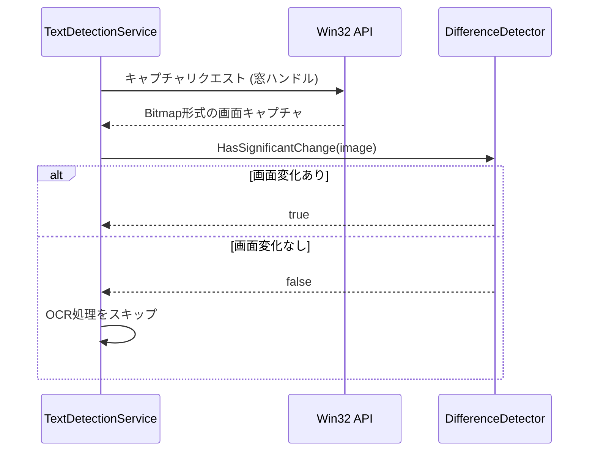
```mermaid
sequenceDiagram
    participant TDS as TextDetectionService
    participant Win32 as Win32 API
    participant DD as DifferenceDetector
    
    TDS->>Win32: キャプチャリクエスト (窓ハンドル)
    Win32-->>TDS: Bitmap形式の画面キャプチャ
    TDS->>DD: HasSignificantChange(image)
    alt 画面変化あり
        DD-->>TDS: true
    else 画面変化なし
        DD-->>TDS: false
        TDS->>TDS: OCR処理をスキップ
    end
```

ゲームウィンドウの画面内容をキャプチャする段階です：

- **入力**: ゲームウィンドウハンドル
- **処理**: Win32 APIを使用して画面をキャプチャ
- **出力**: Bitmap形式の画像データ
- **最適化**: 差分検出により、変化がない場合はそれ以降の処理をスキップ

#### 2.2.2 OCR処理

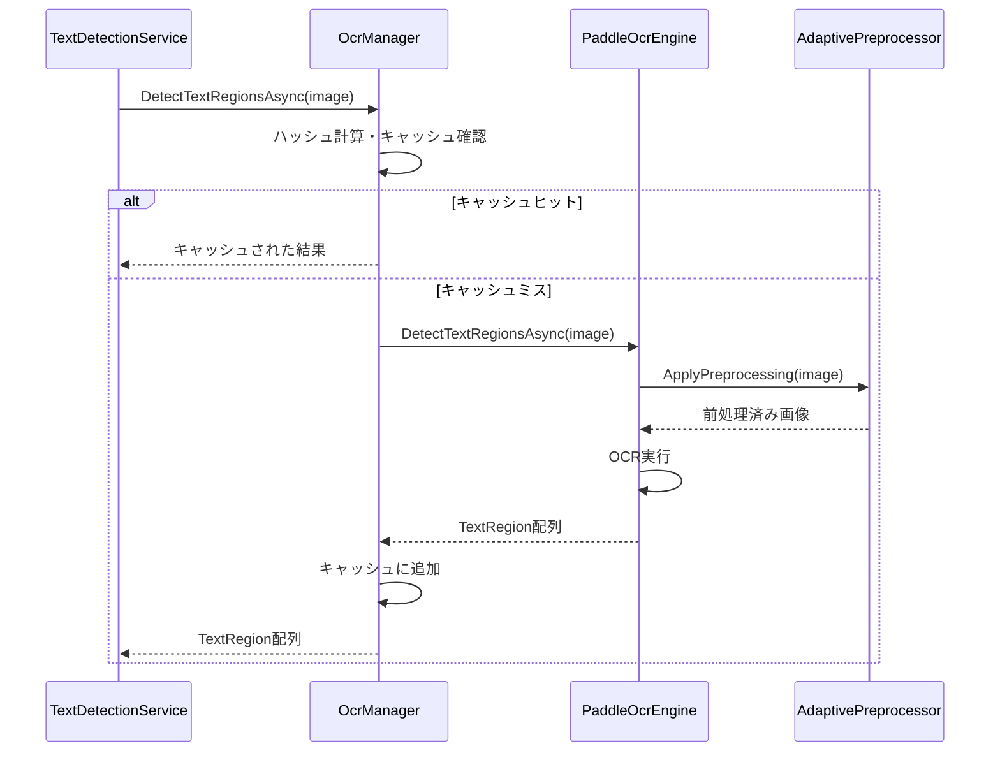
```mermaid
sequenceDiagram
    participant TDS as TextDetectionService
    participant OCRM as OcrManager
    participant PE as PaddleOcrEngine
    participant AP as AdaptivePreprocessor
    
    TDS->>OCRM: DetectTextRegionsAsync(image)
    OCRM->>OCRM: ハッシュ計算・キャッシュ確認
    
    alt キャッシュヒット
        OCRM-->>TDS: キャッシュされた結果
    else キャッシュミス
        OCRM->>PE: DetectTextRegionsAsync(image)
        PE->>AP: ApplyPreprocessing(image)
        AP-->>PE: 前処理済み画像
        PE->>PE: OCR実行
        PE-->>OCRM: TextRegion配列
        OCRM->>OCRM: キャッシュに追加
        OCRM-->>TDS: TextRegion配列
    end
```

画像からテキストを検出して認識する段階です：

- **入力**: Bitmap形式の画像データ
- **処理**:
  1. 画像ハッシュによるキャッシュ確認
  2. キャッシュミス時は画像の前処理
  3. PaddleOCRによるテキスト領域検出
  4. 検出されたテキスト領域からの文字認識
- **出力**: テキスト領域（TextRegion）の配列
  - 文字列（Text）
  - 画面上の位置（Bounds）
  - 認識信頼度（Confidence）
- **最適化**:
  - OCRキャッシュによる重複処理回避
  - 適応型前処理による認識精度向上
  - 段階的スキャンによる認識率の最適化

#### 2.2.3 翻訳処理

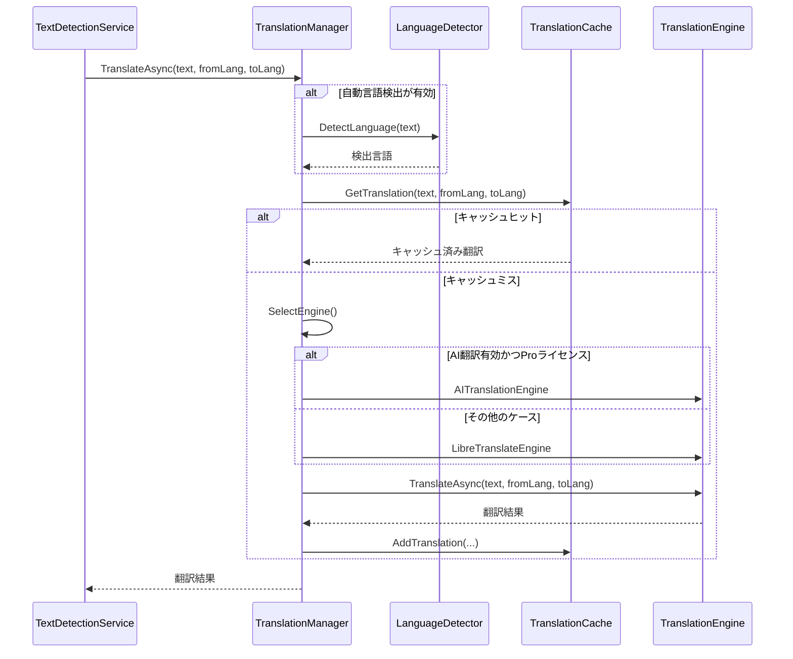
```mermaid
sequenceDiagram
    participant TDS as TextDetectionService
    participant TM as TranslationManager
    participant LD as LanguageDetector
    participant Cache as TranslationCache
    participant Engine as TranslationEngine
    
    TDS->>TM: TranslateAsync(text, fromLang, toLang)
    
    alt 自動言語検出が有効
        TM->>LD: DetectLanguage(text)
        LD-->>TM: 検出言語
    end
    
    TM->>Cache: GetTranslation(text, fromLang, toLang)
    
    alt キャッシュヒット
        Cache-->>TM: キャッシュ済み翻訳
    else キャッシュミス
        TM->>TM: SelectEngine()
        
        alt AI翻訳有効かつProライセンス
            TM->>Engine: AITranslationEngine
        else その他のケース
            TM->>Engine: LibreTranslateEngine
        end
        
        TM->>Engine: TranslateAsync(text, fromLang, toLang)
        Engine-->>TM: 翻訳結果
        TM->>Cache: AddTranslation(...)
    end
    
    TM-->>TDS: 翻訳結果
```

検出されたテキストを翻訳する段階です：

- **入力**: テキスト文字列、元言語、目標言語
- **処理**:
  1. 言語の自動検出（必要な場合）
  2. 翻訳キャッシュの確認
  3. 適切な翻訳エンジンの選択
  4. 翻訳リクエストの実行
  5. 結果のキャッシュ保存
- **出力**: 翻訳されたテキスト
- **最適化**:
  - キャッシュによる翻訳リクエスト削減
  - バッチ処理による複数テキストの効率的な翻訳
  - ライセンスに基づく最適な翻訳エンジンの選択

#### 2.2.4 オーバーレイ表示

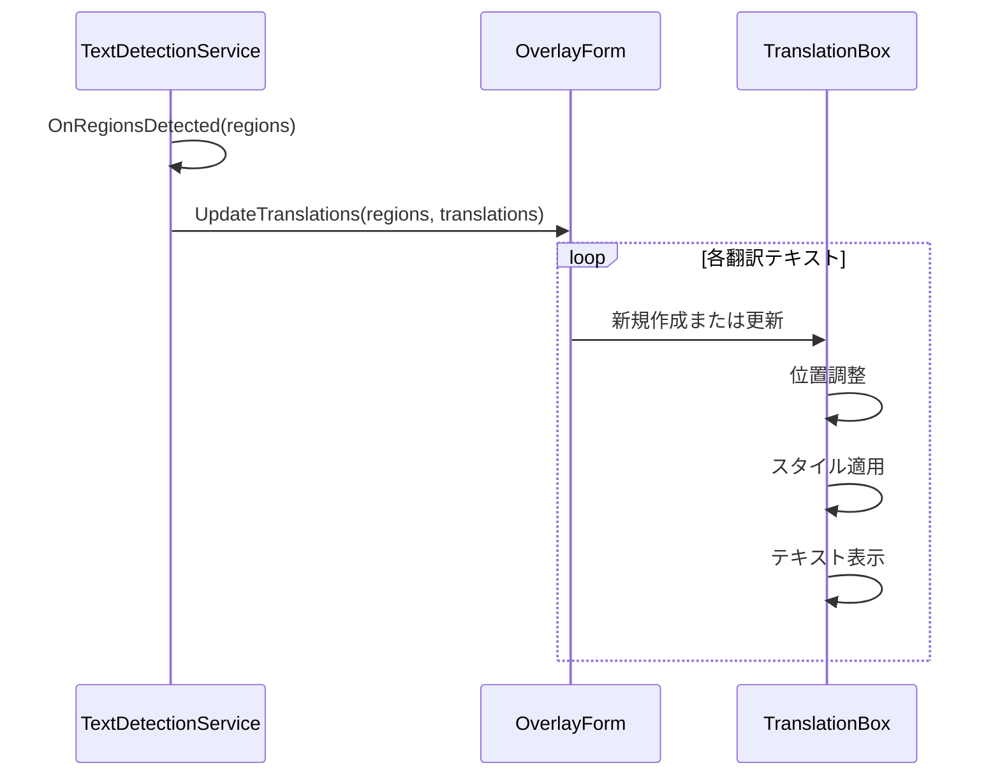
```mermaid
sequenceDiagram
    participant TDS as TextDetectionService
    participant OF as OverlayForm
    participant TB as TranslationBox
    
    TDS->>TDS: OnRegionsDetected(regions)
    TDS->>OF: UpdateTranslations(regions, translations)
    
    loop 各翻訳テキスト
        OF->>TB: 新規作成または更新
        TB->>TB: 位置調整
        TB->>TB: スタイル適用
        TB->>TB: テキスト表示
    end
```

翻訳結果をゲーム画面上にオーバーレイ表示する段階です：

- **入力**: テキスト領域と翻訳結果のペア
- **処理**:
  1. 適切な表示位置の計算
  2. オーバーレイウィンドウの更新
  3. 新しい翻訳ボックスの作成または既存の更新
- **出力**: ゲーム画面上に表示される翻訳テキスト
- **最適化**:
  - クリックスルー機能による非干渉性
  - フェードイン/アウト効果による自然な表示
  - 既存のTranslationBoxの再利用

### 2.3 データ構造

#### 2.3.1 TextRegion クラス

```csharp
public class TextRegion
{
    public string Text { get; set; }              // 認識されたテキスト
    public Rectangle Bounds { get; set; }          // 画面上の位置
    public float Confidence { get; set; }          // 認識信頼度 (0.0-1.0)
    public DateTime DetectedAt { get; set; }       // 検出時刻
}
```

#### 2.3.2 TranslationResult クラス

```csharp
public class TranslationResult
{
    public string OriginalText { get; set; }       // 元のテキスト
    public string TranslatedText { get; set; }     // 翻訳されたテキスト
    public string SourceLanguage { get; set; }     // 翻訳元言語
    public string TargetLanguage { get; set; }     // 翻訳先言語
    public DateTime TranslatedAt { get; set; }     // 翻訳日時
    public string EngineUsed { get; set; }         // 使用した翻訳エンジン
}
```

## 3. 設定の読み込みと保存のフロー

ユーザー設定や環境設定の管理に関するデータフローです。

### 3.1 フロー図

```
+-------------------+     +-------------------+     +-------------------+
| 設定ファイル      | --> | 設定の読み込み    | --> | 設定の検証と変換  |
| (JSON)            |     | AppSettings       |     | SettingsConverter |
+-------------------+     +-------------------+     +-------------------+
                                                            |
                                                            v
+-------------------+     +-------------------+     +-------------------+
| 設定ファイル保存  | <-- | 設定の更新       | <-- | 設定の適用        |
| (JSON)            |     | AppSettings      |     | 各コンポーネント  |
+-------------------+     +-------------------+     +-------------------+
```

### 3.2 詳細プロセス

#### 3.2.1 アプリケーション起動時

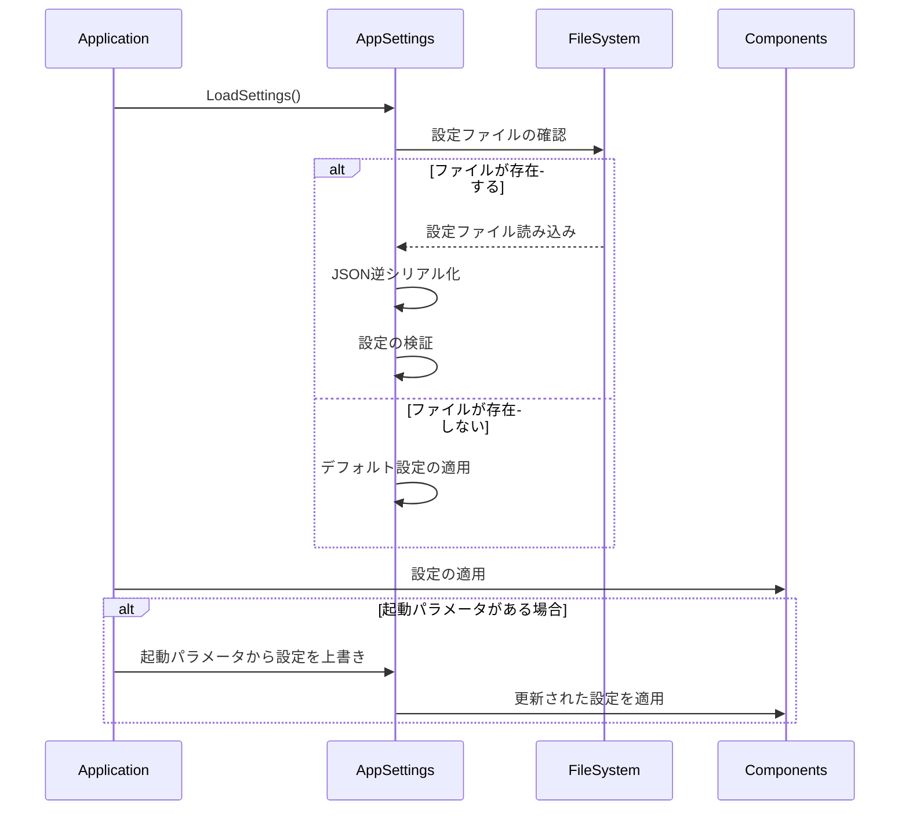
```mermaid
sequenceDiagram
    participant App as Application
    participant AS as AppSettings
    participant FS as FileSystem
    participant Config as Components
    
    App->>AS: LoadSettings()
    AS->>FS: 設定ファイルの確認
    
    alt ファイルが存在する
        FS-->>AS: 設定ファイル読み込み
        AS->>AS: JSON逆シリアル化
        AS->>AS: 設定の検証
    else ファイルが存在しない
        AS->>AS: デフォルト設定の適用
    end
    
    App->>Config: 設定の適用
    
    alt 起動パラメータがある場合
        App->>AS: 起動パラメータから設定を上書き
        AS->>Config: 更新された設定を適用
    end
```

アプリケーション起動時の設定読み込み処理です：

- **入力**: 設定ファイルパス、起動パラメータ
- **処理**: 
  1. 設定ファイルの存在確認
  2. JSONからの設定読み込み
  3. 設定の検証とデフォルト値の適用
  4. 起動パラメータによる上書き
- **出力**: 初期化されたアプリケーション設定
- **最適化**:
  - 必要なときだけ設定を読み込む遅延ロード
  - 設定の変更監視によるリアルタイム反映

#### 3.2.2 設定変更時

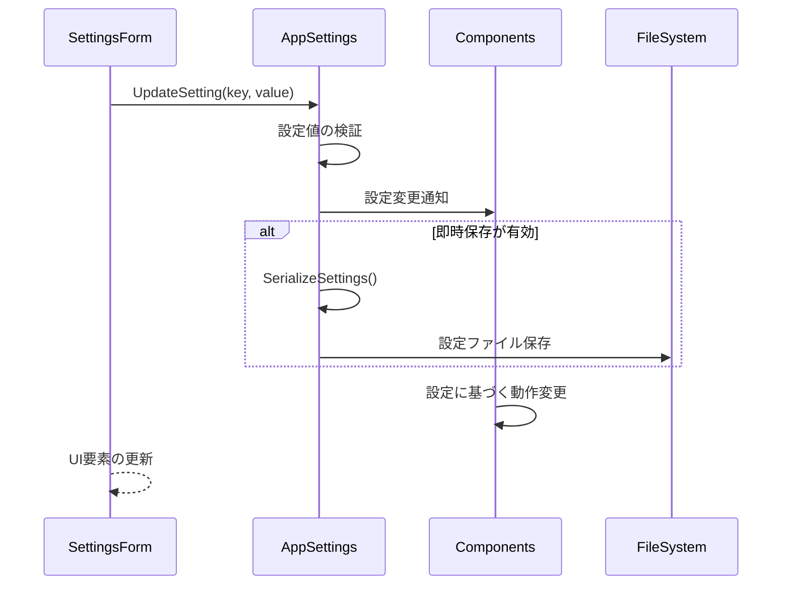
```mermaid
sequenceDiagram
    participant UI as SettingsForm
    participant AS as AppSettings
    participant Components as Components
    participant FS as FileSystem
    
    UI->>AS: UpdateSetting(key, value)
    AS->>AS: 設定値の検証
    AS->>Components: 設定変更通知
    
    alt 即時保存が有効
        AS->>AS: SerializeSettings()
        AS->>FS: 設定ファイル保存
    end
    
    Components->>Components: 設定に基づく動作変更
    UI-->>UI: UI要素の更新
```

ユーザーが設定を変更した際の処理フローです：

- **入力**: 設定キーと新しい値
- **処理**:
  1. 設定値の検証と型変換
  2. 設定の更新
  3. 関連コンポーネントへの通知
  4. 必要に応じて設定ファイルへの保存
- **出力**: 更新された設定と適用結果
- **最適化**:
  - 変更のあった設定のみを更新
  - 設定変更のバッチ処理による保存回数の最小化

#### 3.2.3 設定保存時

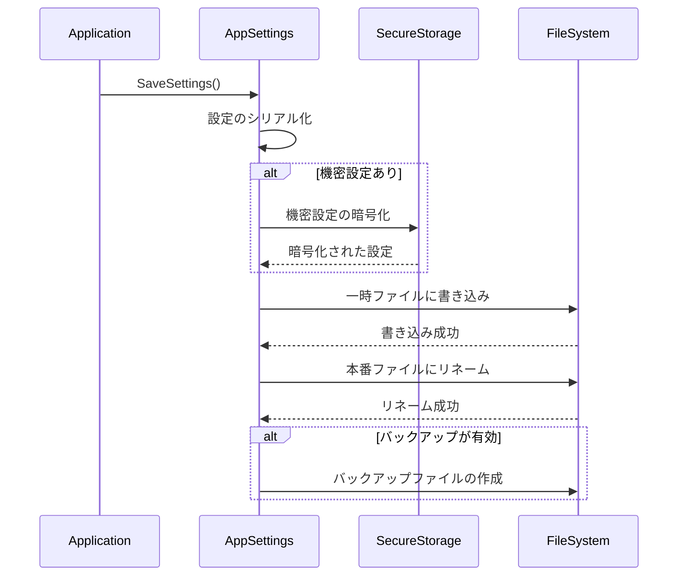
```mermaid
sequenceDiagram
    participant App as Application
    participant AS as AppSettings
    participant SC as SecureStorage
    participant FS as FileSystem
    
    App->>AS: SaveSettings()
    AS->>AS: 設定のシリアル化
    
    alt 機密設定あり
        AS->>SC: 機密設定の暗号化
        SC-->>AS: 暗号化された設定
    end
    
    AS->>FS: 一時ファイルに書き込み
    FS-->>AS: 書き込み成功
    AS->>FS: 本番ファイルにリネーム
    FS-->>AS: リネーム成功
    
    alt バックアップが有効
        AS->>FS: バックアップファイルの作成
    end
```

設定の保存処理フローです：

- **入力**: 現在の設定状態
- **処理**:
  1. 設定のJSON形式へのシリアル化
  2. 機密設定の暗号化
  3. 安全な書き込み（一時ファイル経由）
  4. バックアップの作成
- **出力**: 保存された設定ファイル
- **最適化**:
  - 原子的な書き込みによるファイル破損防止
  - 差分変更のみを保存するオプション

### 3.3 データ構造

#### 3.3.1 AppSettings クラス

```csharp
public class AppSettings
{
    // 一般設定
    public bool AutoStartEnabled { get; set; }      // 自動起動の有効/無効
    public bool MinimizeToTray { get; set; }        // トレイへの最小化
    public string CurrentLanguage { get; set; }     // UI言語
    
    // OCR設定
    public float OcrConfidenceThreshold { get; set; } // OCR信頼度閾値
    public int ScanIntervalMs { get; set; }         // スキャン間隔
    public bool UseAdaptiveInterval { get; set; }   // 適応的間隔の使用
    
    // 翻訳設定
    public string SourceLanguage { get; set; }      // 翻訳元言語
    public string TargetLanguage { get; set; }      // 翻訳先言語
    public bool UseAutoDetection { get; set; }      // 言語自動検出
    public bool UseAiTranslation { get; set; }      // AI翻訳の使用
    
    // UI設定
    public int FontSize { get; set; }               // フォントサイズ
    public string FontFamily { get; set; }          // フォントファミリー
    public string BackgroundColor { get; set; }     // 背景色
    public float Opacity { get; set; }              // 不透明度
    
    // その他
    public Dictionary<string, string> SecureValues { get; private set; } // 暗号化された値
    public bool DebugModeEnabled { get; set; }      // デバッグモード
}
```

## 4. APIキー管理のフロー

APIキーの初期化、使用、更新に関するデータフローです。

### 4.1 フロー図

```
+-------------------+     +-------------------+     +-------------------+
| 暗号化APIキー     | --> | APIキーの読み込み | --> | APIキーの復号化   |
| (リソース/設定)   |     | ApiKeyProtector  |     | EncryptionHelper  |
+-------------------+     +-------------------+     +-------------------+
                                                            |
                                                            v
+-------------------+     +-------------------+     +-------------------+
| 翻訳サービス      | <-- | APIキーの使用     | <-- | メモリ上の        |
| API連携           |     | TranslationManager|     | 安全なキー保管    |
+-------------------+     +-------------------+     +-------------------+
```

### 4.2 詳細プロセス

#### 4.2.1 キーの初期化

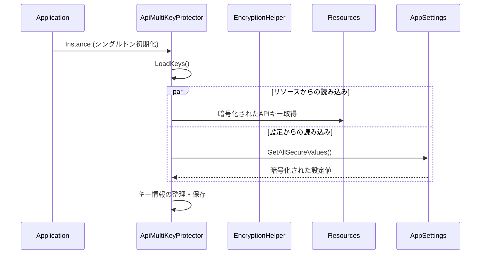
```mermaid
sequenceDiagram
    participant App as Application
    participant AKP as ApiMultiKeyProtector
    participant EH as EncryptionHelper
    participant Res as Resources
    participant AS as AppSettings
    
    App->>AKP: Instance (シングルトン初期化)
    AKP->>AKP: LoadKeys()
    
    par リソースからの読み込み
        AKP->>Res: 暗号化されたAPIキー取得
    and 設定からの読み込み
        AKP->>AS: GetAllSecureValues()
        AS-->>AKP: 暗号化された設定値
    end
    
    AKP->>AKP: キー情報の整理・保存
```

アプリケーション起動時のAPIキー初期化フローです：

- **入力**: 暗号化されたAPIキー（リソースまたは設定ファイル）
- **処理**:
  1. リソースからの組み込みキー読み込み
  2. 設定からのカスタムキー読み込み
  3. キー情報の整理と検証
- **出力**: 使用可能なAPIキーのコレクション
- **最適化**:
  - 必要なときだけキーを復号化（遅延復号）
  - キーの検証によるエラー発生前の対処

#### 4.2.2 キーの使用

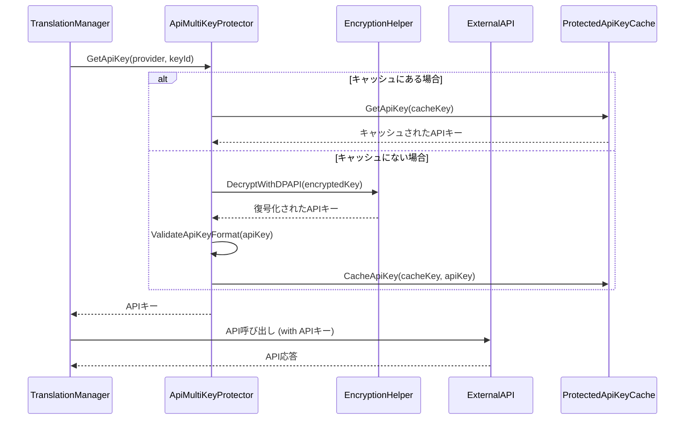
```mermaid
sequenceDiagram
    participant TM as TranslationManager
    participant AKP as ApiMultiKeyProtector
    participant EH as EncryptionHelper
    participant API as ExternalAPI
    participant Cache as ProtectedApiKeyCache
    
    TM->>AKP: GetApiKey(provider, keyId)
    
    alt キャッシュにある場合
        AKP->>Cache: GetApiKey(cacheKey)
        Cache-->>AKP: キャッシュされたAPIキー
    else キャッシュにない場合
        AKP->>EH: DecryptWithDPAPI(encryptedKey)
        EH-->>AKP: 復号化されたAPIキー
        AKP->>AKP: ValidateApiKeyFormat(apiKey)
        AKP->>Cache: CacheApiKey(cacheKey, apiKey)
    end
    
    AKP-->>TM: APIキー
    TM->>API: API呼び出し (with APIキー)
    API-->>TM: API応答
```

APIキーを使用した外部サービスへのアクセスフローです：

- **入力**: プロバイダー名、キーID
- **処理**:
  1. キーの取得リクエスト
  2. キャッシュの確認
  3. 必要に応じた復号化
  4. APIキーの検証
  5. キーの使用（API呼び出し）
- **出力**: API呼び出し結果
- **最適化**:
  - メモリ内キャッシュによる復号化の最小化
  - キーの形式検証によるエラー防止
  - 復号化タイミングの最適化

#### 4.2.3 キーの更新

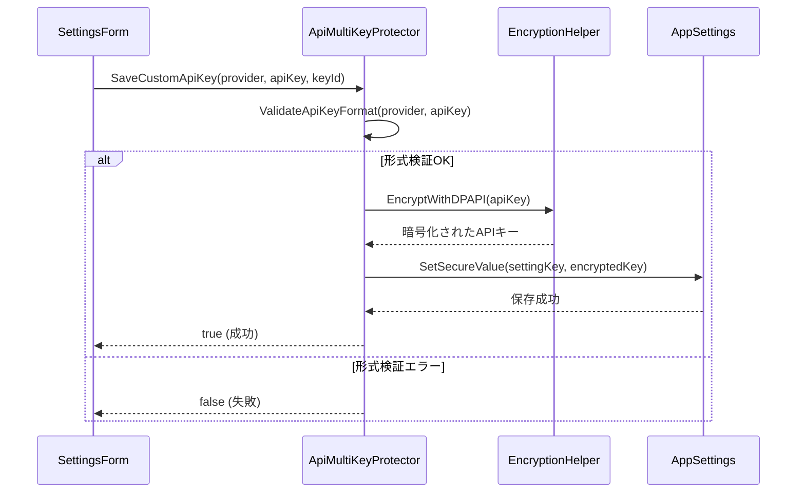
```mermaid
sequenceDiagram
    participant UI as SettingsForm
    participant AKP as ApiMultiKeyProtector
    participant EH as EncryptionHelper
    participant AS as AppSettings
    
    UI->>AKP: SaveCustomApiKey(provider, apiKey, keyId)
    AKP->>AKP: ValidateApiKeyFormat(provider, apiKey)
    
    alt 形式検証OK
        AKP->>EH: EncryptWithDPAPI(apiKey)
        EH-->>AKP: 暗号化されたAPIキー
        AKP->>AS: SetSecureValue(settingKey, encryptedKey)
        AS-->>AKP: 保存成功
        AKP-->>UI: true (成功)
    else 形式検証エラー
        AKP-->>UI: false (失敗)
    end
```

ユーザーによるAPIキー更新フローです：

- **入力**: プロバイダー名、新しいAPIキー、キーID
- **処理**:
  1. APIキーの形式検証
  2. キーの暗号化
  3. 設定への保存
  4. メモリ内キャッシュの更新
- **出力**: 更新結果（成功/失敗）
- **最適化**:
  - 事前検証によるエラー通知
  - キーのサニタイズ処理
  - キャッシュの即時更新

### 4.3 データ構造

#### 4.3.1 ApiMultiKeyProtector クラス

```csharp
public class ApiMultiKeyProtector : IApiKeyProvider
{
    private static ApiMultiKeyProtector _instance;
    
    // プロバイダー > キーID > 暗号化されたキー値 のマッピング
    private Dictionary<string, Dictionary<string, string>> _keys = 
        new Dictionary<string, Dictionary<string, string>>();
    
    // APIキー取得
    public string GetApiKey(string provider, string keyId = "default") { /* ... */ }
    
    // カスタムAPIキーの保存
    public bool SaveCustomApiKey(string provider, string apiKey, string keyId = "default") { /* ... */ }
    
    // APIキー形式検証
    public bool ValidateApiKeyFormat(string provider, string apiKey) { /* ... */ }
}
```

## 5. ゲームプロファイル管理のフロー

ゲームごとの最適化設定の管理に関するデータフローです。

### 5.1 フロー図

```
+-------------------+     +-------------------+     +-------------------+
| ゲーム検出        | --> | プロファイル検索  | --> | プロファイル適用  |
| WindowManager     |     | GameProfiles     |     | OcrManager        |
+-------------------+     +-------------------+     +-------------------+
                                 ^
                                 |
+-------------------+     +-------------------+     +-------------------+
| プロファイル共有  | --> | プロファイル保存  | <-- | AI最適化          |
| 将来機能          |     | GameProfiles     |     | OcrOptimizer      |
+-------------------+     +-------------------+     +-------------------+
```

### 5.2 詳細プロセス

#### 5.2.1 ゲームプロファイルの適用

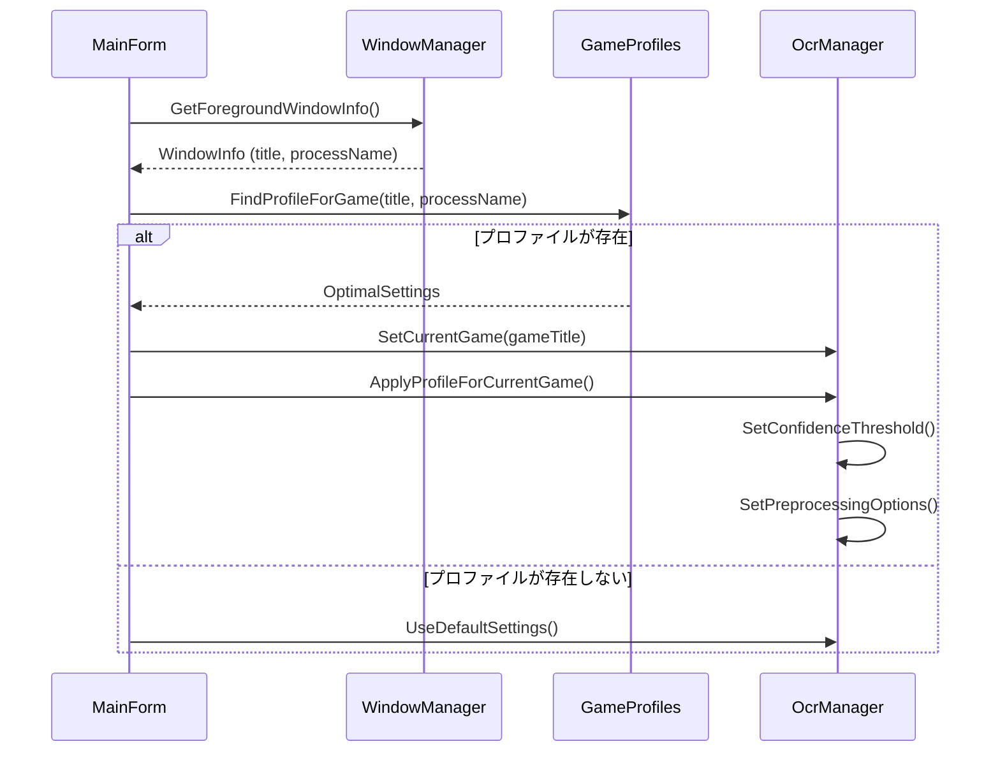
```mermaid
sequenceDiagram
    participant MainForm as MainForm
    participant WM as WindowManager
    participant GP as GameProfiles
    participant OCRM as OcrManager
    
    MainForm->>WM: GetForegroundWindowInfo()
    WM-->>MainForm: WindowInfo (title, processName)
    MainForm->>GP: FindProfileForGame(title, processName)
    
    alt プロファイルが存在
        GP-->>MainForm: OptimalSettings
        MainForm->>OCRM: SetCurrentGame(gameTitle)
        MainForm->>OCRM: ApplyProfileForCurrentGame()
        OCRM->>OCRM: SetConfidenceThreshold()
        OCRM->>OCRM: SetPreprocessingOptions()
    else プロファイルが存在しない
        MainForm->>OCRM: UseDefaultSettings()
    end
```

ゲーム変更時のプロファイル適用フローです：

- **入力**: ゲームウィンドウ情報（タイトル、プロセス名）
- **処理**:
  1. ゲーム識別情報の取得
  2. プロファイルの検索
  3. 該当プロファイルの読み込み
  4. OCR設定への適用
- **出力**: 適用された最適OCR設定
- **最適化**:
  - 高速なプロファイル検索
  - プロファイル適用履歴のキャッシング
  - 一部設定のみの部分適用オプション

#### 5.2.2 AI支援による最適化

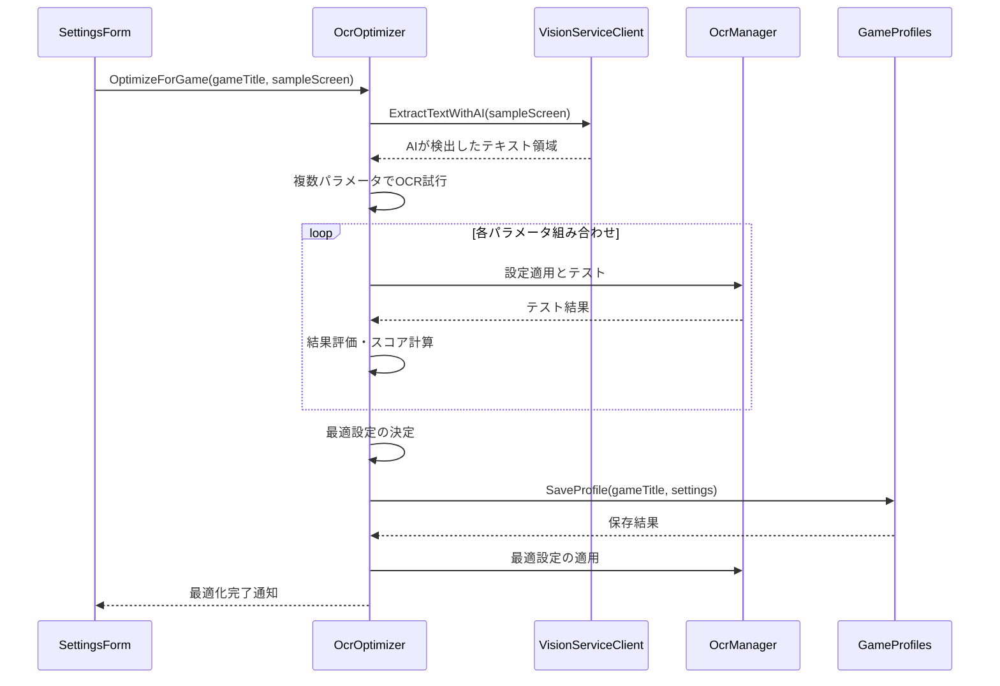
```mermaid
sequenceDiagram
    participant UI as SettingsForm
    participant OCRO as OcrOptimizer
    participant VS as VisionServiceClient
    participant OCRM as OcrManager
    participant GP as GameProfiles
    
    UI->>OCRO: OptimizeForGame(gameTitle, sampleScreen)
    OCRO->>VS: ExtractTextWithAI(sampleScreen)
    VS-->>OCRO: AIが検出したテキスト領域
    
    OCRO->>OCRO: 複数パラメータでOCR試行
    
    loop 各パラメータ組み合わせ
        OCRO->>OCRM: 設定適用とテスト
        OCRM-->>OCRO: テスト結果
        OCRO->>OCRO: 結果評価・スコア計算
    end
    
    OCRO->>OCRO: 最適設定の決定
    OCRO->>GP: SaveProfile(gameTitle, settings)
    GP-->>OCRO: 保存結果
    OCRO->>OCRM: 最適設定の適用
    OCRO-->>UI: 最適化完了通知
```

AIを活用したOCR設定の最適化フローです：

- **入力**: ゲームタイトル、ゲーム画面のサンプル
- **処理**:
  1. AI Vision APIによるテキスト領域の検出
  2. 複数のOCRパラメータ組み合わせのテスト
  3. 結果の比較評価
  4. 最適設定の決定と保存
- **出力**: ゲーム固有の最適OCR設定
- **最適化**:
  - パラメータ探索の効率化
  - AIサービス呼び出しの最小化
  - 設定評価の並列処理

### 5.3 データ構造

#### 5.3.1 OptimalSettings クラス

```csharp
public class OptimalSettings
{
    public float ConfidenceThreshold { get; set; }               // 信頼度閾値
    public PreprocessingOptions PreprocessingOptions { get; set; }// 前処理オプション
    public DateTime LastOptimized { get; set; }                  // 最終最適化日時
    public int OptimizationAttempts { get; set; }                // 最適化試行回数
    public bool IsOptimized { get; set; }                        // 最適化済みフラグ
}
```

#### 5.3.2 GameProfiles クラス

```csharp
public class GameProfiles
{
    private Dictionary<string, OptimalSettings> _profiles = 
        new Dictionary<string, OptimalSettings>();
    
    // プロファイル取得
    public OptimalSettings GetProfile(string gameTitle) { /* ... */ }
    
    // プロファイル保存
    public bool SaveProfile(string gameTitle, OptimalSettings settings) { /* ... */ }
    
    // プロファイル検索
    public OptimalSettings FindProfileForGame(string windowTitle, string processName) { /* ... */ }
    
    // プロファイルのエクスポート
    public bool ExportProfile(string gameTitle, string filePath) { /* ... */ }
    
    // プロファイルのインポート
    public bool ImportProfile(string filePath, out string gameTitle) { /* ... */ }
}
```

## 6. エラー処理とリカバリーのフロー

アプリケーション実行中の例外処理と回復メカニズムに関するデータフローです。

### 6.1 フロー図

```
+-------------------+     +-------------------+     +-------------------+
| 例外発生          | --> | エラーハンドリング| --> | ログ記録          |
| 各コンポーネント  |     | try-catch        |     | Logger            |
+-------------------+     +-------------------+     +-------------------+
                                                            |
                                                            v
+-------------------+     +-------------------+     +-------------------+
| 通常動作再開      | <-- | 回復処理         | <-- | エラー通知        |
| または終了        |     | RecoveryManager  |     | ErrorReporter     |
+-------------------+     +-------------------+     +-------------------+
```

### 6.2 詳細プロセス

#### 6.2.1 OCR例外ハンドリング

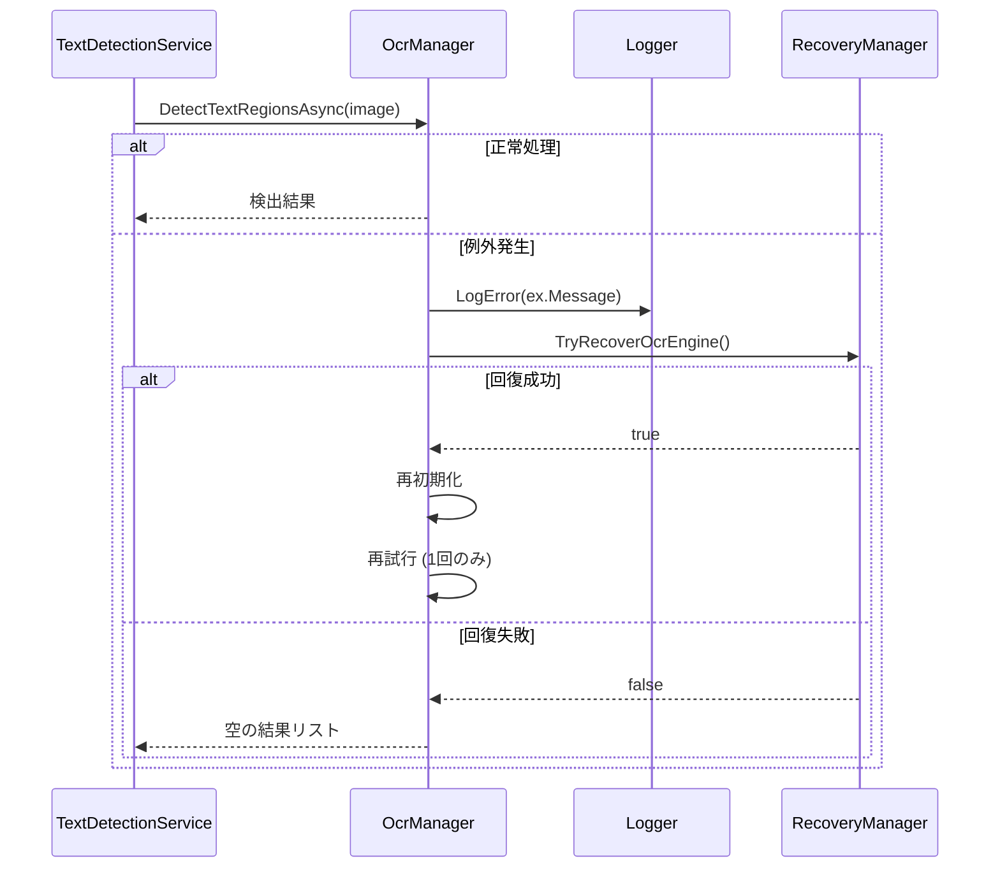
```mermaid
sequenceDiagram
    participant TDS as TextDetectionService
    participant OCRM as OcrManager
    participant Log as Logger
    participant RM as RecoveryManager
    
    TDS->>OCRM: DetectTextRegionsAsync(image)
    
    alt 正常処理
        OCRM-->>TDS: 検出結果
    else 例外発生
        OCRM->>Log: LogError(ex.Message)
        OCRM->>RM: TryRecoverOcrEngine()
        
        alt 回復成功
            RM-->>OCRM: true
            OCRM->>OCRM: 再初期化
            OCRM->>OCRM: 再試行 (1回のみ)
        else 回復失敗
            RM-->>OCRM: false
            OCRM-->>TDS: 空の結果リスト
        end
    end
```

OCR処理時の例外ハンドリングフローです：

- **入力**: 例外情報
- **処理**:
  1. エラーのログ記録
  2. エンジンのリカバリー試行
  3. 必要に応じた再初期化
  4. 限定的な再試行
- **出力**: 回復結果または空の結果
- **最適化**:
  - 致命的でないエラーからの自動回復
  - 再試行回数の制限
  - ユーザー体験への影響最小化

#### 6.2.2 翻訳例外ハンドリング

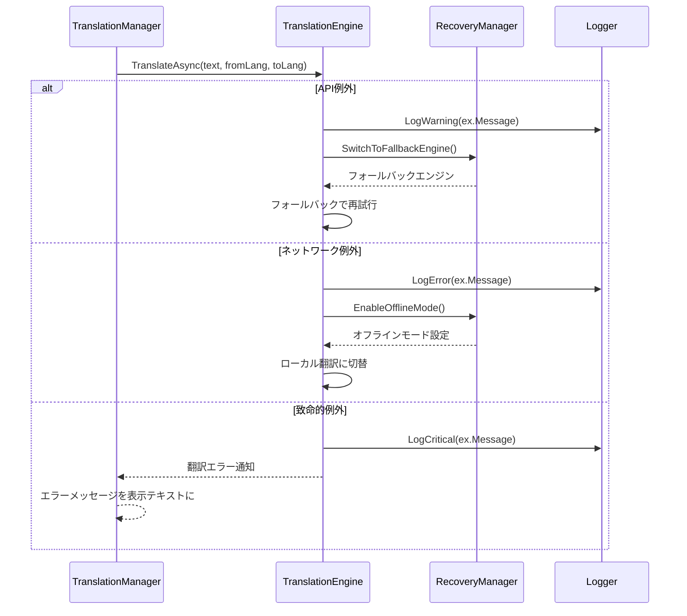
```mermaid
sequenceDiagram
    participant TM as TranslationManager
    participant TE as TranslationEngine
    participant RM as RecoveryManager
    participant Log as Logger
    
    TM->>TE: TranslateAsync(text, fromLang, toLang)
    
    alt API例外
        TE->>Log: LogWarning(ex.Message)
        TE->>RM: SwitchToFallbackEngine()
        RM-->>TE: フォールバックエンジン
        TE->>TE: フォールバックで再試行
    else ネットワーク例外
        TE->>Log: LogError(ex.Message)
        TE->>RM: EnableOfflineMode()
        RM-->>TE: オフラインモード設定
        TE->>TE: ローカル翻訳に切替
    else 致命的例外
        TE->>Log: LogCritical(ex.Message)
        TE-->>TM: 翻訳エラー通知
        TM-->>TM: エラーメッセージを表示テキストに
    end
```

翻訳処理時の例外ハンドリングフローです：

- **入力**: 例外情報、例外の種類
- **処理**:
  1. 例外の種類に応じた処理分岐
  2. API例外時のフォールバックエンジン使用
  3. ネットワーク例外時のオフラインモード切替
  4. 致命的例外時のエラー通知
- **出力**: 代替翻訳結果またはエラーメッセージ
- **最適化**:
  - エラーの種類に応じた最適な対応
  - オフラインでの継続動作保証
  - サービス回復時の自動復帰

### 6.3 データ構造

#### 6.3.1 カスタム例外クラス

```csharp
// OCR例外
public class OcrException : Exception
{
    public OcrErrorType ErrorType { get; }
    
    public OcrException(string message, OcrErrorType errorType = OcrErrorType.General)
        : base(message)
    {
        ErrorType = errorType;
    }
    
    public OcrException(string message, Exception innerException, OcrErrorType errorType = OcrErrorType.General)
        : base(message, innerException)
    {
        ErrorType = errorType;
    }
}

// OCRエラータイプ
public enum OcrErrorType
{
    General,            // 一般的なエラー
    InitializationError,// 初期化エラー
    DetectionError,     // テキスト検出エラー
    RecognitionError,   // テキスト認識エラー
    ResourceError       // リソースエラー
}

// 翻訳例外
public class TranslationException : Exception
{
    public TranslationErrorType ErrorType { get; }
    
    public TranslationException(string message, TranslationErrorType errorType = TranslationErrorType.General)
        : base(message)
    {
        ErrorType = errorType;
    }
    
    public TranslationException(string message, Exception innerException, TranslationErrorType errorType = TranslationErrorType.General)
        : base(message, innerException)
    {
        ErrorType = errorType;
    }
}

// 翻訳エラータイプ
public enum TranslationErrorType
{
    General,            // 一般的なエラー
    NetworkError,       // ネットワークエラー
    ApiError,           // API呼び出しエラー
    AuthenticationError,// 認証エラー
    RateLimitError,     // レート制限エラー
    UnsupportedLanguage // 未対応言語エラー
}
```

## 7. パフォーマンス最適化ポイント

システム全体のデータフローにおける主なパフォーマンス最適化ポイントを示します。

### 7.1 キャッシュ最適化

1. **OCRキャッシュ**
   - **目的**: 同一画面に対する重複OCR処理の回避
   - **実装**: 画像ハッシュによるキャッシュ検索、LRU（Least Recently Used）アルゴリズムによるキャッシュ管理
   - **効果**: CPU使用率の大幅削減、レスポンス時間の短縮

2. **翻訳キャッシュ**
   - **目的**: 同一テキストに対する重複翻訳リクエストの回避
   - **実装**: テキスト+言語ペアをキーとしたキャッシュ、同一ゲーム内でのよくある翻訳を優先的に保持
   - **効果**: API呼び出し回数の削減、コスト削減、レスポンス時間の短縮

3. **APIキーキャッシュ**
   - **目的**: 頻繁な暗号化/復号化処理の回避
   - **実装**: メモリ内の安全なキャッシュ、限定的な保持時間
   - **効果**: CPU使用率の削減、セキュリティリスクの最小化

### 7.2 差分検出

- **目的**: 変化のない画面に対するOCR処理の回避
- **実装**: サンプリングによる高速な差分検出、閾値に基づく変化判定
- **効果**: CPU使用率の削減、バッテリー消費の削減、OCRエンジンの負荷軽減

### 7.3 アダプティブ処理間隔

- **目的**: ゲーム状況に応じた最適な処理頻度の調整
- **実装**: 画面変化率やテキスト検出率に基づく動的な処理間隔調整
- **効果**: アイドル時のリソース消費削減、重要なテキスト表示時の迅速な対応

### 7.4 並列処理と非同期化

- **目的**: UI応答性の維持とマルチコア活用
- **実装**: OCR処理と翻訳処理の並列実行、UI更新の非同期処理
- **効果**: 全体的なレスポンス時間の短縮、UI体験の向上

### 7.5 リソース管理の最適化

- **目的**: メモリリークの防止と長時間安定動作の確保
- **実装**: リソースの明示的な解放、使用していないリソースの定期的なクリーンアップ
- **効果**: メモリ使用量の削減、長時間動作時の安定性向上

## 8. 関連ドキュメント

- [システムアーキテクチャ](./system-architecture.md) - システム全体の構造と依存関係
- [OCRコンポーネント](./components/ocr-component.md) - OCR処理の詳細設計
- [翻訳コンポーネント](./components/translation-component.md) - 翻訳処理の詳細設計
- [UIコンポーネント](./components/ui-component.md) - UI関連の詳細設計
- [セキュリティコンポーネント](./components/security-component.md) - セキュリティ機能の詳細設計
- [パフォーマンス最適化計画](../03-implementation/performance-optimization.md) - 詳細な最適化戦略と実装指針
