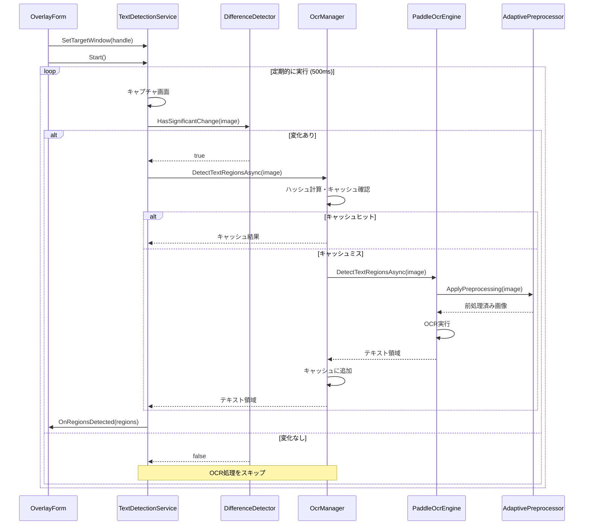
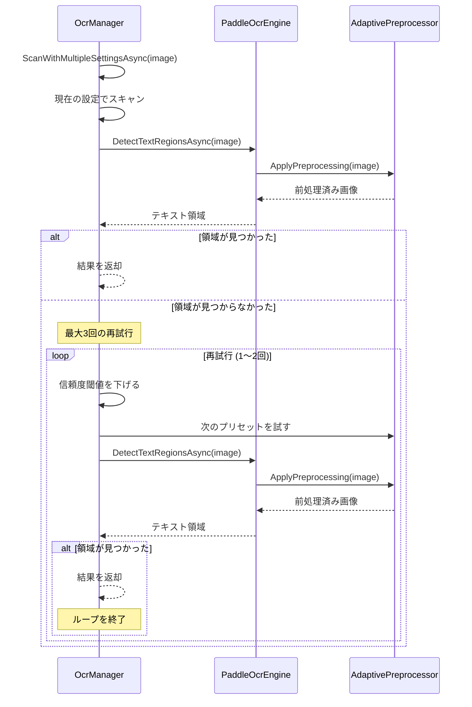

# ゲーム翻訳オーバーレイアプリケーション - OCRコンポーネント

## 1. 概要

OCR（光学文字認識）コンポーネントは、ゲーム翻訳オーバーレイアプリケーションの核心的機能を提供するモジュールです。このコンポーネントは、ゲーム画面からテキストを検出・認識し、翻訳のためのテキストデータを生成します。PaddleOCRを基盤として、高精度かつ低レイテンシのテキスト認識を実現し、ユーザー体験を妨げないパフォーマンスを維持します。

### 1.1 目的と役割

- ゲーム画面を定期的にキャプチャし、テキスト領域を検出する
- 検出されたテキスト領域の内容を認識し、テキストデータに変換する
- 各ゲームに適した最適なOCR設定を管理する
- パフォーマンスを最適化し、ゲームプレイへの影響を最小限に抑える
- 異なる言語やフォントスタイルに対応したテキスト認識を提供する

### 1.2 主要機能

- **リアルタイムOCR処理**: ゲームプレイ中のリアルタイムテキスト検出
- **適応型前処理**: テキスト認識精度を向上させるための画像前処理
- **差分検出**: 画面変化の検出によるパフォーマンス最適化
- **プロファイル管理**: ゲームごとの最適OCR設定の管理
- **AI支援最適化**: 人工知能を活用した最適OCR設定の自動決定
- **段階的スキャン**: 複数の設定を試行して最適な結果を得る機能

## 2. アーキテクチャ

### 2.1 コンポーネント図

```
+----------------------+      +----------------------+
|                      |      |                      |
|  TextDetectionService| ---> |      OcrManager      |
|                      |      |                      |
+----------------------+      +----------+-----------+
        |                                |
        v                                v
+----------------------+      +----------------------+
|                      |      |                      |
|  DifferenceDetector  |      |   PaddleOcrEngine   |
|                      |      |                      |
+----------------------+      +----------+-----------+
                                         |
                                         v
                              +----------------------+
                              |                      |
                              | AdaptivePreprocessor |
                              |                      |
                              +----------------------+
```

### 2.2 クラス構造

#### 2.2.1 主要クラス

| クラス名 | 名前空間 | 責務 |
|----------|----------|------|
| OcrManager | GameTranslationOverlay.Core.OCR | OCR処理の一元管理、設定管理 |
| PaddleOcrEngine | GameTranslationOverlay.Core.OCR | PaddleOCRを使用したテキスト認識 |
| TextDetectionService | GameTranslationOverlay.Core.OCR | 画面キャプチャとテキスト検出 |
| DifferenceDetector | GameTranslationOverlay.Core.OCR | 画面変更の検出 |
| AdaptivePreprocessor | GameTranslationOverlay.Core.Utils | 画像の前処理と最適化 |
| OcrOptimizer | GameTranslationOverlay.Core.OCR.AI | AI支援によるOCR最適化 |

#### 2.2.2 主要インターフェース

```csharp
/// <summary>
/// OCRエンジンのインターフェース
/// </summary>
public interface IOcrEngine : IDisposable
{
    /// <summary>
    /// OCRエンジンを初期化する
    /// </summary>
    Task InitializeAsync();
    
    /// <summary>
    /// 指定された領域のテキストを認識する
    /// </summary>
    Task<string> RecognizeTextAsync(Rectangle region);
    
    /// <summary>
    /// 画像内のテキスト領域を検出する
    /// </summary>
    Task<List<TextRegion>> DetectTextRegionsAsync(Bitmap image);
    
    /// <summary>
    /// 信頼度閾値を設定する
    /// </summary>
    void SetConfidenceThreshold(float threshold);
    
    /// <summary>
    /// 前処理オプションを設定する
    /// </summary>
    void SetPreprocessingOptions(PreprocessingOptions options);
    
    /// <summary>
    /// 前処理の有効/無効を設定する
    /// </summary>
    void EnablePreprocessing(bool enable);
}

/// <summary>
/// テキスト検出サービスのインターフェース
/// </summary>
public interface ITextDetectionService : IDisposable
{
    /// <summary>
    /// テキスト検出を開始する
    /// </summary>
    void Start();
    
    /// <summary>
    /// テキスト検出を停止する
    /// </summary>
    void Stop();
    
    /// <summary>
    /// 対象ウィンドウを設定する
    /// </summary>
    void SetTargetWindow(IntPtr windowHandle);
    
    /// <summary>
    /// テキスト領域が検出されたときのイベント
    /// </summary>
    event EventHandler<List<TextRegion>> OnRegionsDetected;
    
    /// <summary>
    /// テキスト領域が検出されなかったときのイベント
    /// </summary>
    event EventHandler OnNoRegionsDetected;
}
```

#### 2.2.3 データモデル

```csharp
/// <summary>
/// テキスト領域を表すクラス
/// </summary>
public class TextRegion
{
    /// <summary>
    /// テキスト内容
    /// </summary>
    public string Text { get; set; }
    
    /// <summary>
    /// テキストの画面上の位置
    /// </summary>
    public Rectangle Bounds { get; set; }
    
    /// <summary>
    /// 認識の信頼度 (0.0-1.0)
    /// </summary>
    public float Confidence { get; set; }
    
    /// <summary>
    /// 検出時刻
    /// </summary>
    public DateTime DetectedAt { get; set; }
    
    /// <summary>
    /// 類似のテキスト領域かどうかを判定
    /// </summary>
    public bool IsSimilarTo(TextRegion other, double thresholdDistance = 10.0)
    {
        // 実装内容...
    }
}

/// <summary>
/// 画像の前処理オプション
/// </summary>
public class PreprocessingOptions
{
    /// <summary>
    /// コントラストレベル (1.0 = 変更なし)
    /// </summary>
    public float ContrastLevel { get; set; } = 1.0f;
    
    /// <summary>
    /// 明るさレベル (1.0 = 変更なし)
    /// </summary>
    public float BrightnessLevel { get; set; } = 1.0f;
    
    /// <summary>
    /// シャープネスレベル (0.0 = 変更なし)
    /// </summary>
    public float SharpnessLevel { get; set; } = 0.0f;
    
    /// <summary>
    /// ノイズ軽減レベル
    /// </summary>
    public int NoiseReduction { get; set; } = 0;
    
    /// <summary>
    /// 二値化閾値 (0 = 二値化しない)
    /// </summary>
    public int Threshold { get; set; } = 0;
    
    /// <summary>
    /// スケール係数 (1.0 = 変更なし)
    /// </summary>
    public float ScaleFactor { get; set; } = 1.0f;
    
    /// <summary>
    /// 周囲のパディング（ピクセル）
    /// </summary>
    public int Padding { get; set; } = 0;
}
```

## 3. 主要クラスの詳細

### 3.1 OcrManager

OcrManagerはOCR処理を一元管理し、IOcrEngineインターフェースを実装します。現在の実装ではPaddleOCRが唯一のエンジンとして使用されていますが、将来的に別のエンジンにも対応可能な設計となっています。

#### 3.1.1 主要フィールド

```csharp
// OCRエンジン
private PaddleOcrEngine _paddleOcrEngine;

// 適応型プリプロセッサ
private AdaptivePreprocessor _adaptivePreprocessor;

// 処理設定
private float _confidenceThreshold = 0.6f;
private bool _usePreprocessing = true;
private bool _useAdaptiveMode = true;
private bool _useProgressiveScan = true;

// OCRキャッシュ
private readonly Dictionary<int, List<TextRegion>> _ocrCache = new Dictionary<int, List<TextRegion>>();
```

#### 3.1.2 主要メソッド

```csharp
// OCRエンジン初期化
public async Task InitializeAsync() { /* ... */ }

// テキスト領域検出
public async Task<List<TextRegion>> DetectTextRegionsAsync(Bitmap image) { /* ... */ }

// 特定領域のテキスト認識
public async Task<string> RecognizeTextAsync(Rectangle region) { /* ... */ }

// 信頼度閾値設定
public void SetConfidenceThreshold(float threshold) { /* ... */ }

// 前処理オプション設定
public void SetPreprocessingOptions(PreprocessingOptions options) { /* ... */ }

// ゲームプロファイル管理
public bool SetCurrentGame(string gameTitle) { /* ... */ }
public bool ApplyProfileForCurrentGame() { /* ... */ }
public bool SaveProfileForCurrentGame() { /* ... */ }
```

### 3.2 PaddleOcrEngine

PaddleOcrEngineはPaddleOCRライブラリを使用してテキスト認識を行います。画像の前処理と後処理も担当し、認識結果を構造化します。

#### 3.2.1 主要フィールド

```csharp
// PaddleOCR APIへのラッパー
private PaddleOCRSharp.OCRParameter _ocrParameter;
private PaddleOCRSharp.PaddleOCREngine _paddleEngine;

// 前処理設定
private PreprocessingOptions _preprocessingOptions;
private bool _enablePreprocessing = true;
```

#### 3.2.2 主要メソッド

```csharp
// 初期化
public async Task InitializeAsync() { /* ... */ }

// テキスト領域検出
public async Task<List<TextRegion>> DetectTextRegionsAsync(Bitmap image) { /* ... */ }

// 前処理適用
private Bitmap ApplyPreprocessing(Bitmap image) { /* ... */ }

// OCR結果変換
private List<TextRegion> ConvertToTextRegions(PaddleOCRSharp.OCRResult result) { /* ... */ }
```

### 3.3 TextDetectionService

TextDetectionServiceは定期的に画面をキャプチャし、テキスト領域の検出を行います。検出結果はイベントを通じて他のコンポーネントに通知されます。

#### 3.3.1 主要フィールド

```csharp
// 依存サービス
private IOcrEngine _ocrEngine;
private DifferenceDetector _differenceDetector;

// ターゲットウィンドウ
private IntPtr _targetWindowHandle = IntPtr.Zero;

// 処理タイマー
private Timer _detectionTimer;
private int _detectionIntervalMs = 500;
private bool _isRunning = false;
```

#### 3.3.2 主要メソッド

```csharp
// 処理開始
public void Start() { /* ... */ }

// 処理停止
public void Stop() { /* ... */ }

// ウィンドウ設定
public void SetTargetWindow(IntPtr windowHandle) { /* ... */ }

// タイマーイベントハンドラ
private async void DetectionTimer_Tick(object sender, EventArgs e) { /* ... */ }
```

### 3.4 DifferenceDetector

DifferenceDetectorは連続するキャプチャ画像の差分を検出し、変化がない場合にOCR処理をスキップすることでパフォーマンスを最適化します。

#### 3.4.1 主要フィールド

```csharp
// 前回のキャプチャ画像
private Bitmap _previousImage;

// 差分検出設定
private double _differenceThreshold = 0.01; // 変化と判断する閾値（1%）
```

#### 3.4.2 主要メソッド

```csharp
// 画面変化の検出
public bool HasSignificantChange(Bitmap currentImage) { /* ... */ }

// 差分計算
private double CalculateDifference(Bitmap current, Bitmap previous) { /* ... */ }
```

### 3.5 AdaptivePreprocessor

AdaptivePreprocessorは画像認識の精度を向上させるために、画像に対して様々な前処理を適用します。複数のプリセットを持ち、最も効果的な設定を自動的に選択します。

#### 3.5.1 主要フィールド

```csharp
// 前処理設定のプリセット
private List<PreprocessingOptions> _presets;
private int _currentPresetIndex = 0;

// 現在の設定
private PreprocessingOptions _currentOptions;
```

#### 3.5.2 主要メソッド

```csharp
// 前処理の適用
public Bitmap ApplyPreprocessing(Bitmap image) { /* ... */ }

// 次のプリセットを試行
public bool TryNextPreset() { /* ... */ }

// ゲームプロファイルの適用
public void ApplyGameProfile(string profileName) { /* ... */ }
```

### 3.6 OcrOptimizer

OcrOptimizerはAIを活用してゲームごとに最適なOCR設定を自動的に特定します。AIビジョンサービス（OpenAI Vision、Google Gemini）を使用してテキスト領域を高精度に特定し、その結果に基づいて最適なOCR設定を導き出します。

#### 3.6.1 主要フィールド

```csharp
// 依存サービス
private IOcrEngine _ocrEngine;
private GameProfiles _gameProfiles;
private VisionServiceClient _visionClient;

// 最適化設定
private int _optimizationAttempts = 3;
private float _baseConfidenceThreshold = 0.4f;
```

#### 3.6.2 主要メソッド

```csharp
// ゲームに対する最適化
public async Task<OptimalSettings> OptimizeForGame(string gameTitle, Bitmap sampleScreen) { /* ... */ }

// AIによるテキスト抽出
private async Task<List<TextRegion>> ExtractTextWithAI(Bitmap image) { /* ... */ }

// 最適設定の適用
public bool ApplyOptimalSettingsForGame(string gameTitle) { /* ... */ }
```

## 4. 処理フロー

### 4.1 テキスト検出の基本フロー



### 4.2 段階的スキャンの処理フロー



### 4.3 AI最適化の処理フロー

```mermaid
sequenceDiagram
    participant UI as SettingsForm
    participant OPT as OcrOptimizer
    participant OCR as OcrManager
    participant VS as VisionServiceClient
    participant GP as GameProfiles
    
    UI->>OPT: OptimizeForGame(gameTitle, sampleScreen)
    OPT->>VS: ExtractTextWithAI(sampleScreen)
    VS-->>OPT: AI検出テキスト領域
    
    OPT->>OPT: 複数パラメータでOCR試行
    loop パラメータ組み合わせ
        OPT->>OCR: 設定変更・テスト
        OCR-->>OPT: テスト結果
    end
    
    OPT->>OPT: 最適設定を判定
    OPT->>GP: SaveProfile(gameTitle, settings)
    OPT->>OCR: ApplySettings(settings)
    OPT-->>UI: 最適化完了通知
```

## 5. 最適化技術

### 5.1 差分検出最適化

画面内容に変化がない場合、OCR処理を省略することでCPU負荷を大幅に削減します。

```csharp
public bool HasSignificantChange(Bitmap currentImage)
{
    // 前回の画像がない場合は変化ありとみなす
    if (_previousImage == null)
    {
        SaveCurrentImage(currentImage);
        return true;
    }

    // サイズが異なる場合は変化ありと判断
    if (_previousImage.Width != currentImage.Width || 
        _previousImage.Height != currentImage.Height)
    {
        SaveCurrentImage(currentImage);
        return true;
    }
    
    // 画像の差分を計算
    double difference = CalculateDifference(currentImage, _previousImage);
    
    // 差分が閾値を超えていれば変化ありと判断
    if (difference > _differenceThreshold)
    {
        SaveCurrentImage(currentImage);
        return true;
    }
    
    return false;
}
```

差分検出の計算は効率化のため、サンプリングポイントのみを比較します：

```csharp
private double CalculateDifference(Bitmap current, Bitmap previous)
{
    // サンプリングによる効率的な差分計算
    const int sampleSize = 20; // 20x20のグリッドでサンプリング
    int differentPixels = 0;
    int totalSamples = 0;
    
    // 効率的なピクセルアクセスのためにLockBitsを使用
    Rectangle rect = new Rectangle(0, 0, current.Width, current.Height);
    BitmapData bmpData1 = current.LockBits(rect, ImageLockMode.ReadOnly, current.PixelFormat);
    BitmapData bmpData2 = previous.LockBits(rect, ImageLockMode.ReadOnly, previous.PixelFormat);
    
    try
    {
        int bytesPerPixel = Image.GetPixelFormatSize(current.PixelFormat) / 8;
        int byteCount = bmpData1.Stride * current.Height;
        byte[] pixels1 = new byte[byteCount];
        byte[] pixels2 = new byte[byteCount];
        
        // ピクセルデータをコピー
        Marshal.Copy(bmpData1.Scan0, pixels1, 0, byteCount);
        Marshal.Copy(bmpData2.Scan0, pixels2, 0, byteCount);
        
        int stepX = Math.Max(1, current.Width / sampleSize);
        int stepY = Math.Max(1, current.Height / sampleSize);
        
        for (int y = 0; y < current.Height; y += stepY)
        {
            for (int x = 0; x < current.Width; x += stepX)
            {
                int pos = y * bmpData1.Stride + x * bytesPerPixel;
                
                // 各色チャネルの差分を計算
                int bDiff = Math.Abs(pixels1[pos] - pixels2[pos]);
                int gDiff = Math.Abs(pixels1[pos + 1] - pixels2[pos + 1]);
                int rDiff = Math.Abs(pixels1[pos + 2] - pixels2[pos + 2]);
                
                int colorDiff = rDiff + gDiff + bDiff;
                
                if (colorDiff > 30)
                {
                    differentPixels++;
                }
                
                totalSamples++;
            }
        }
        
        return (double)differentPixels / totalSamples;
    }
    finally
    {
        // 必ずアンロック
        current.UnlockBits(bmpData1);
        previous.UnlockBits(bmpData2);
    }
}
```

### 5.2 OCRキャッシュ

同一または類似の画像に対するOCR処理の結果をキャッシュすることで、処理時間を削減します。

```csharp
// 画像のハッシュ値を計算（簡易的な方法）
private int CalculateImageHash(Bitmap image)
{
    // 単純なハッシュ計算（完全なマッチングではなく近似）
    int hash = 17;
    hash = hash * 31 + image.Width;
    hash = hash * 31 + image.Height;

    // 数ポイントをサンプリングして特徴を抽出
    int samplingSize = 5;
    int stepX = Math.Max(1, image.Width / samplingSize);
    int stepY = Math.Max(1, image.Height / samplingSize);

    for (int y = 0; y < image.Height; y += stepY)
    {
        for (int x = 0; x < image.Width; x += stepX)
        {
            if (x < image.Width && y < image.Height)
            {
                Color pixel = image.GetPixel(x, y);
                // 色の大まかな特徴だけを使用
                int colorValue = (pixel.R / 32) * 1000000 + (pixel.G / 32) * 1000 + (pixel.B / 32);
                hash = hash * 31 + colorValue;
            }
        }
    }

    return hash;
}
```

### 5.3 段階的スキャン

OCR設定を段階的に変えながら複数回スキャンすることで、認識率を向上させます。

```csharp
private async Task<List<TextRegion>> ScanWithMultipleSettingsAsync(Bitmap image)
{
    // 最初に現在の設定で試行
    var regions = await ScanWithCurrentSettingsAsync(image);

    // 結果があれば終了
    if (regions.Count > 0)
        return regions;

    // 異なる設定でさらに試行
    for (int attempt = 1; attempt < MAX_SCAN_ATTEMPTS; attempt++)
    {
        Debug.WriteLine($"テキスト検出再試行 ({attempt}/{MAX_SCAN_ATTEMPTS - 1})...");

        // 閾値を一時的に下げる
        float originalThreshold = _confidenceThreshold;
        _confidenceThreshold = Math.Max(_confidenceThreshold - (0.1f * attempt), 0.1f);

        // 次のプリセットを試す（一時的に）
        if (_usePreprocessing && _useAdaptiveMode)
        {
            _adaptivePreprocessor.TryNextPreset();
        }

        try
        {
            // 再試行
            regions = await ScanWithCurrentSettingsAsync(image);
        }
        finally
        {
            // 設定を元に戻す
            _confidenceThreshold = originalThreshold;
        }

        // 結果があれば終了
        if (regions.Count > 0)
        {
            Debug.WriteLine($"再試行で{regions.Count}個のテキスト領域を検出");
            return regions;
        }
    }

    // すべての試行が失敗した場合は空のリストを返す
    return new List<TextRegion>();
}
```

### 5.4 適応型前処理

テキスト認識の精度を向上させるために、画像に対して様々な前処理を適用します。最も効果的な前処理設定を自動的に選択します。

```csharp
// プリセット前処理設定
private void InitializePresets()
{
    _presets = new List<PreprocessingOptions>
    {
        // 標準プリセット（軽度のコントラスト強化）
        new PreprocessingOptions
        {
            ContrastLevel = 1.2f,
            BrightnessLevel = 1.0f,
            SharpnessLevel = 0.5f,
            NoiseReduction = 0,
            Threshold = 0,
            ScaleFactor = 1.0f,
            Padding = 0
        },
        
        // 高コントラストプリセット（低コントラスト画像用）
        new PreprocessingOptions
        {
            ContrastLevel = 1.5f,
            BrightnessLevel = 1.1f,
            SharpnessLevel = 0.7f,
            NoiseReduction = 1,
            Threshold = 0,
            ScaleFactor = 1.0f,
            Padding = 0
        },
        
        // 拡大プリセット（小さいテキスト用）
        new PreprocessingOptions
        {
            ContrastLevel = 1.2f,
            BrightnessLevel = 1.0f,
            SharpnessLevel = 0.5f,
            NoiseReduction = 0,
            Threshold = 0,
            ScaleFactor = 1.5f,
            Padding = 0
        },
        
        // シャープ強化プリセット（ぼやけたテキスト用）
        new PreprocessingOptions
        {
            ContrastLevel = 1.2f,
            BrightnessLevel = 1.0f,
            SharpnessLevel = 1.0f,
            NoiseReduction = 0,
            Threshold = 0,
            ScaleFactor = 1.0f,
            Padding = 0
        }
    };
    
    // 現在のプリセットを初期設定
    _currentPresetIndex = 0;
    _currentOptions = _presets[_currentPresetIndex];
}
```

### 5.5 メモリ管理

アプリケーションのメモリ使用量を監視し、必要に応じてリソースを解放します。

```csharp
private class MemoryManagement
{
    private static readonly long HighMemoryThresholdMB = 300; // 高メモリ使用と判断する閾値（MB）
    private static readonly TimeSpan MonitorInterval = TimeSpan.FromMinutes(5); // 監視間隔
    private static DateTime _lastCheck = DateTime.MinValue;

    /// <summary>
    /// メモリ使用量を確認し、必要に応じてクリーンアップを実行
    /// </summary>
    public static void CheckMemoryUsage()
    {
        // 前回のチェックから一定時間が経過していない場合はスキップ
        if (DateTime.Now - _lastCheck < MonitorInterval)
        {
            return;
        }

        _lastCheck = DateTime.Now;

        try
        {
            using (Process currentProcess = Process.GetCurrentProcess())
            {
                // 現在のメモリ使用量を取得（MB単位）
                long memoryUsageMB = currentProcess.PrivateMemorySize64 / (1024 * 1024);

                Debug.WriteLine($"メモリ使用量: {memoryUsageMB}MB");

                // 高メモリ使用の場合、クリーンアップを促進
                if (memoryUsageMB > HighMemoryThresholdMB)
                {
                    Debug.WriteLine($"高メモリ使用を検出（{memoryUsageMB}MB）: クリーンアップを実行します");

                    // リソースマネージャーのクリーンアップを促進
                    ResourceManager.CleanupDeadReferences();

                    // GCの実行を促進
                    GC.Collect();
                    GC.WaitForPendingFinalizers();

                    // 2回目のGC（断片化対策）
                    GC.Collect();

                    // クリーンアップ後のメモリ使用量を確認
                    long afterCleanupMB = currentProcess.PrivateMemorySize64 / (1024 * 1024);
                    Debug.WriteLine($"クリーンアップ後のメモリ使用量: {afterCleanupMB}MB（{memoryUsageMB - afterCleanupMB}MB削減）");
                }
            }
        }
        catch (Exception ex)
        {
            Debug.WriteLine($"メモリ使用量確認エラー: {ex.Message}");
        }
    }
}
```

## 6. ゲームプロファイル管理

### 6.1 プロファイル構造

各ゲームに対して最適なOCR設定を保存・管理する機能を提供します。

```csharp
/// <summary>
/// OCR最適設定を表すクラス
/// </summary>
public class OptimalSettings
{
    /// <summary>
    /// 信頼度閾値
    /// </summary>
    public float ConfidenceThreshold { get; set; } = 0.5f;
    
    /// <summary>
    /// 前処理オプション
    /// </summary>
    public PreprocessingOptions PreprocessingOptions { get; set; } = new PreprocessingOptions();
    
    /// <summary>
    /// 最終最適化日時
    /// </summary>
    public DateTime LastOptimized { get; set; } = DateTime.Now;
    
    /// <summary>
    /// 最適化試行回数
    /// </summary>
    public int OptimizationAttempts { get; set; } = 0;
    
    /// <summary>
    /// 最適化済みかどうか
    /// </summary>
    public bool IsOptimized { get; set; } = false;
}
```

### 6.2 プロファイルの適用

```csharp
/// <summary>
/// 現在のゲームのプロファイルを適用
/// </summary>
/// <returns>プロファイルが適用された場合はtrue</returns>
public bool ApplyProfileForCurrentGame()
{
    if (_gameProfiles == null || string.IsNullOrWhiteSpace(_currentGameTitle))
    {
        return false;
    }

    try
    {
        // プロファイル取得
        var settings = _gameProfiles.GetProfile(_currentGameTitle);
        if (settings == null || !settings.IsOptimized)
        {
            Debug.WriteLine($"ゲーム '{_currentGameTitle}' の有効なプロファイルがありません");
            return false;
        }

        // 設定適用
        SetConfidenceThreshold(settings.ConfidenceThreshold);
        SetPreprocessingOptions(settings.PreprocessingOptions);
        EnablePreprocessing(true);

        Debug.WriteLine($"ゲーム '{_currentGameTitle}' のプロファイルを適用しました（信頼度: {settings.ConfidenceThreshold:F2}）");
        return true;
    }
    catch (Exception ex)
    {
        Debug.WriteLine($"プロファイル適用エラー: {ex.Message}");
        return false;
    }
}
```

### 6.3 プロファイルの保存

```csharp
/// <summary>
/// 現在のゲームのプロファイルを保存/更新
/// </summary>
/// <returns>保存に成功した場合はtrue</returns>
public bool SaveProfileForCurrentGame()
{
    if (_gameProfiles == null || string.IsNullOrWhiteSpace(_currentGameTitle))
    {
        Debug.WriteLine("ゲームプロファイル保存: ゲームプロファイル管理またはゲームタイトルが未設定");
        return false;
    }

    try
    {
        // 既存のプロファイルがあれば取得
        var existingSettings = _gameProfiles.GetProfile(_currentGameTitle);
        int optimizationAttempts = existingSettings?.OptimizationAttempts ?? 0;

        // 現在の設定でプロファイルを作成/更新
        var settings = new OCR.AI.OcrOptimizer.OptimalSettings
        {
            ConfidenceThreshold = _confidenceThreshold,
            PreprocessingOptions = _adaptivePreprocessor.CurrentPreprocessingOptions,
            LastOptimized = DateTime.Now,
            OptimizationAttempts = optimizationAttempts + 1,
            IsOptimized = true
        };

        // プロファイル保存
        _gameProfiles.SaveProfile(_currentGameTitle, settings);
        Debug.WriteLine($"ゲーム '{_currentGameTitle}' のプロファイルを保存しました");
        return true;
    }
    catch (Exception ex)
    {
        Debug.WriteLine($"プロファイル保存エラー: {ex.Message}");
        return false;
    }
}
```

### 6.4 AI支援による最適化

OcrOptimizerクラスでは、AIビジョンサービスを使用してゲーム画面からテキスト領域を高精度に抽出し、その結果に基づいて最適なOCR設定を導き出します。

```csharp
/// <summary>
/// ゲームに対する最適化を実行
/// </summary>
public async Task<OptimalSettings> OptimizeForGame(string gameTitle, Bitmap sampleScreen)
{
    if (string.IsNullOrWhiteSpace(gameTitle) || sampleScreen == null)
    {
        throw new ArgumentException("ゲームタイトルとサンプル画面が必要です");
    }

    try
    {
        // AI支援によるテキスト抽出
        var aiTextRegions = await ExtractTextWithAI(sampleScreen);
        
        if (aiTextRegions.Count == 0)
        {
            throw new Exception("AIによるテキスト抽出に失敗しました");
        }

        // 最適なパラメータを探索
        OptimalSettings bestSettings = null;
        int bestMatchCount = 0;

        // 様々なパラメータでテスト
        for (float confidence = 0.4f; confidence <= 0.7f; confidence += 0.1f)
        {
            for (float contrast = 1.0f; contrast <= 1.4f; contrast += 0.2f)
            {
                for (float brightness = 0.9f; brightness <= 1.2f; brightness += 0.1f)
                {
                    // テスト設定
                    var testSettings = new OptimalSettings
                    {
                        ConfidenceThreshold = confidence,
                        PreprocessingOptions = new PreprocessingOptions
                        {
                            ContrastLevel = contrast,
                            BrightnessLevel = brightness,
                            SharpnessLevel = 0.5f
                        }
                    };

                    // 設定を適用してOCRテスト
                    _ocrEngine.SetConfidenceThreshold(testSettings.ConfidenceThreshold);
                    _ocrEngine.SetPreprocessingOptions(testSettings.PreprocessingOptions);
                    _ocrEngine.EnablePreprocessing(true);

                    var ocrResults = await _ocrEngine.DetectTextRegionsAsync(sampleScreen);

                    // AIの結果とOCRの結果を比較
                    int matchCount = CountMatches(aiTextRegions, ocrResults);

                    // より良い結果があれば保存
                    if (matchCount > bestMatchCount)
                    {
                        bestMatchCount = matchCount;
                        bestSettings = testSettings;
                    }
                }
            }
        }

        if (bestSettings == null)
        {
            throw new Exception("最適な設定を見つけられませんでした");
        }

        // ゲームプロファイルに保存
        bestSettings.LastOptimized = DateTime.Now;
        bestSettings.IsOptimized = true;
        _gameProfiles.SaveProfile(gameTitle, bestSettings);

        // 最適設定を適用
        _ocrEngine.SetConfidenceThreshold(bestSettings.ConfidenceThreshold);
        _ocrEngine.SetPreprocessingOptions(bestSettings.PreprocessingOptions);
        _ocrEngine.EnablePreprocessing(true);

        return bestSettings;
    }
    catch (Exception ex)
    {
        Debug.WriteLine($"ゲーム最適化エラー: {ex.Message}");
        throw;
    }
}
```

## 7. パフォーマンス考慮事項

### 7.1 CPU使用率最適化

- **差分検出**: 画面変化がない場合はOCR処理をスキップ
- **処理間隔の動的調整**: 画面変化の頻度に応じて検出間隔を調整
- **キャッシュ**: 同一画面に対する重複処理を回避
- **バックグラウンド処理の優先度低下**: ゲームプレイへの影響を最小化

### 7.2 メモリ使用量最適化

- **リソース追跡**: ResourceManagerによるリソース管理
- **定期的なクリーンアップ**: 使用していないリソースの積極的な解放
- **メモリ使用量監視**: 閾値超過時の自動クリーンアップ
- **キャッシュサイズ制限**: 一定数を超えるキャッシュエントリの削除

### 7.3 レイテンシ最適化

- **非同期処理**: UI応答性を維持するための非同期処理
- **効率的なビットマップ処理**: LockBitsによる高速なピクセルアクセス
- **段階的処理**: 高速→精密の段階的処理による応答時間短縮
- **プロファイル適用**: ゲームごとに最適化された設定の即時適用

### 7.4 目標パフォーマンス指標

| 指標 | 目標値 | 実現手法 |
|-----|-------|---------|
| CPU使用率 | アイドル時5%以下、処理時20%以下 | 差分検出、適応的間隔、キャッシュ |
| メモリ使用量 | 300MB以下 | リソース追跡、定期クリーンアップ |
| 検出-表示レイテンシ | 300ms以下 | 非同期処理、キャッシュ、段階的処理 |
| 精度 | 標準フォント95%以上 | 適応的前処理、AI最適化 |

## 8. エラー処理と回復

### 8.1 エラー検出と記録

- **例外ハンドリング**: すべての主要操作は適切な例外ハンドリングを実装
- **エラーログ**: Loggerクラスによる詳細なエラーログ記録
- **性能監視**: 処理時間などの性能指標の記録と分析

### 8.2 回復メカニズム

- **処理タイムアウト**: 長時間の処理がフリーズした場合の自動キャンセル
- **段階的スキャン**: 初期設定で失敗した場合の代替設定での再試行
- **デフォルト設定へのリセット**: エラーが繰り返される場合の設定リセット
- **メモリクリーンアップ**: メモリ不足エラー時の自動リソース解放

## 9. 拡張ポイント

### 9.1 新OCRエンジンの追加

IOcrEngineインターフェースを実装することで、新しいOCRエンジンを統合可能：

```csharp
public class NewOcrEngine : IOcrEngine
{
    // IOcrEngineインターフェースの実装
    public Task InitializeAsync() { /* ... */ }
    public Task<List<TextRegion>> DetectTextRegionsAsync(Bitmap image) { /* ... */ }
    public Task<string> RecognizeTextAsync(Rectangle region) { /* ... */ }
    public void SetConfidenceThreshold(float threshold) { /* ... */ }
    public void SetPreprocessingOptions(PreprocessingOptions options) { /* ... */ }
    public void EnablePreprocessing(bool enable) { /* ... */ }
    public void Dispose() { /* ... */ }
}
```

### 9.2 カスタム前処理

AdaptivePreprocessorを拡張または新しい前処理手法を追加可能：

```csharp
public class CustomPreprocessor : IPreprocessor
{
    // IPreprocessorインターフェースの実装
    public Bitmap ApplyPreprocessing(Bitmap image, PreprocessingOptions options) { /* ... */ }
}
```

### 9.3 AIサービス連携の拡張

新しいAIビジョンサービスを追加する場合：

```csharp
public class NewVisionServiceClient : IVisionServiceClient
{
    // IVisionServiceClientインターフェースの実装
    public Task<List<TextRegion>> ExtractTextFromImageAsync(Bitmap image) { /* ... */ }
}
```

## 10. 現在の実装状況

### 10.1 実装済み機能

- [x] PaddleOCRエンジン統合
- [x] テキスト検出サービス
- [x] 差分検出最適化
- [x] 適応型前処理
- [x] OCRキャッシュ
- [x] 段階的スキャン
- [x] ゲームプロファイル管理
- [x] メモリ使用量最適化

### 10.2 開発中機能

- [ ] AI支援によるOCR最適化（基本機能実装済み、AIサービス連携調整中）
- [ ] より高度な言語検出と分析（文字種に基づく分析実装済み、精度向上中）
- [ ] 処理間隔の自動最適化（基本機能実装済み、アルゴリズム改良中）

### 10.3 将来の拡張計画

- [ ] 複数OCRエンジンの併用による精度向上
- [ ] 英語/日本語以外の言語への対応拡大
- [ ] オフライン用軽量OCRモデルの統合
- [ ] ゲームプロファイルのオンライン共有機能
- [ ] 電子書籍特有の最適化（ページレイアウト分析など）

## 11. 関連ドキュメント

- [アーキテクチャ概要](../01-overview/architecture-summary.md) - アーキテクチャの全体像
- [システムアーキテクチャ詳細](../02-design/system-architecture.md) - システム全体の設計
- [翻訳コンポーネント](../02-design/components/translation-component.md) - 翻訳機能の詳細設計
- [パフォーマンス最適化計画](../03-implementation/performance-optimization.md) - 最適化の詳細
- [テスト計画](../04-testing/test-plan.md) - OCR機能のテスト方法
