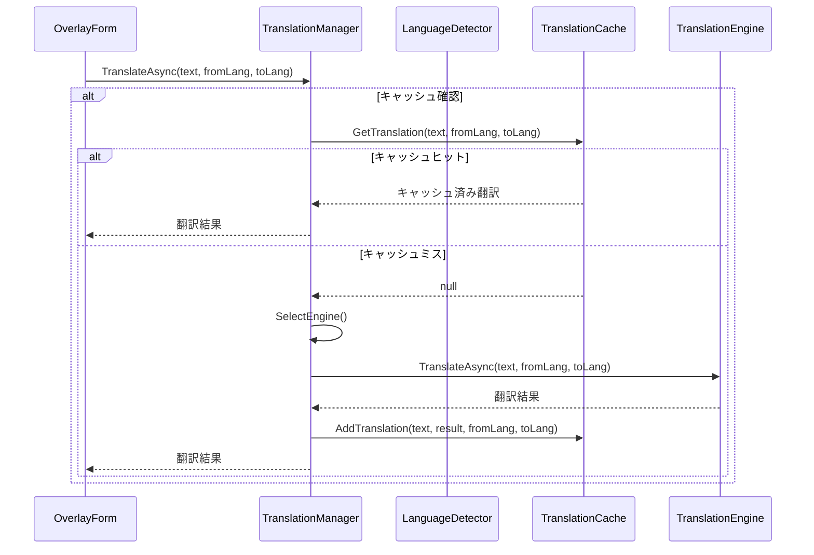
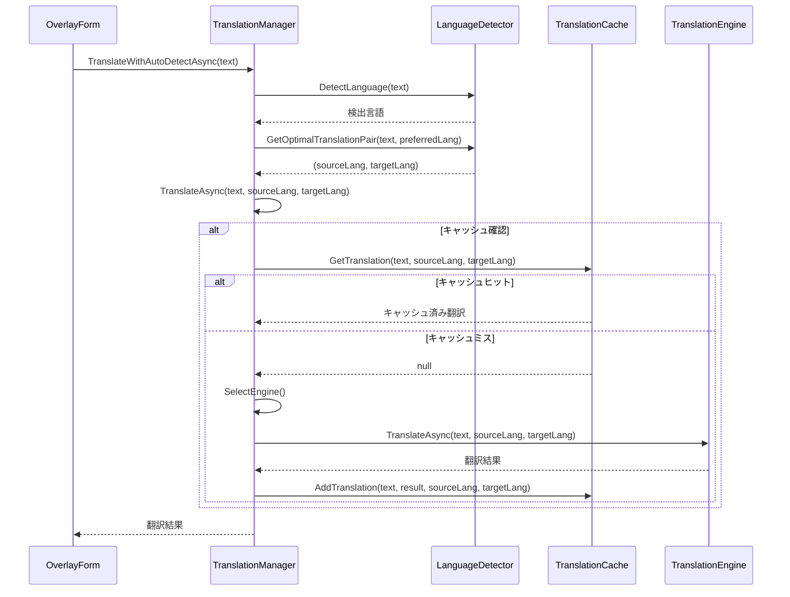
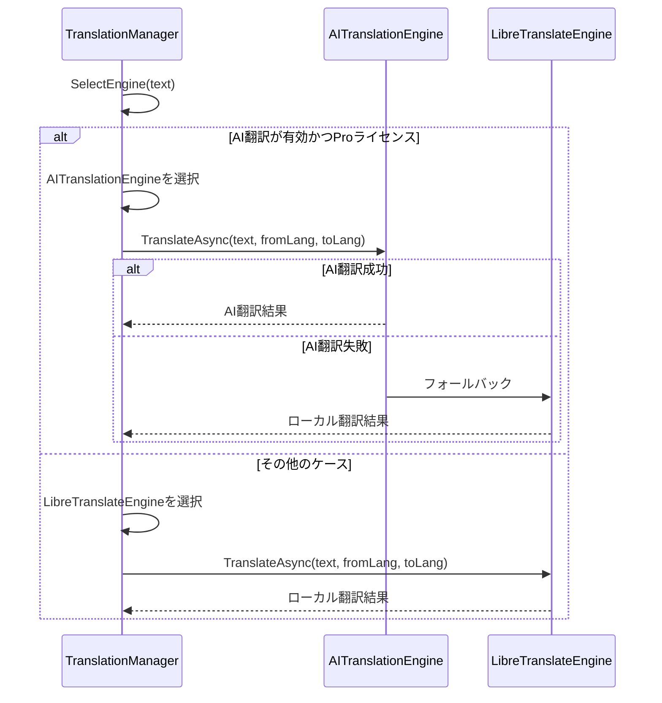

# ゲーム翻訳オーバーレイアプリケーション - 翻訳コンポーネント

## 1. 概要

翻訳コンポーネントは、ゲーム翻訳オーバーレイアプリケーションの中核機能の一つであり、OCRコンポーネントで検出されたテキストを異なる言語に翻訳する役割を担います。このコンポーネントは、多言語翻訳の高精度かつ高速な処理を提供し、オンライン・オフラインの両方の翻訳サービスを柔軟に組み合わせることを特徴としています。

### 1.1 目的と役割

- OCRで認識されたテキストを指定された言語に翻訳する
- 異なる翻訳エンジン（ローカル/オンライン）の管理と切り替え
- 翻訳の高速化のためのキャッシュ管理
- 言語自動検出による適切な翻訳方向の決定
- 翻訳精度向上のための前後処理の実施
- ライセンスに基づくAI翻訳サービスへのアクセス制御

### 1.2 主要機能

- **マルチエンジン翻訳**: 複数の翻訳エンジンの管理と使用
- **翻訳キャッシュ**: 処理済みテキストのキャッシュによる高速化
- **言語自動検出**: テキストの言語特性に基づく自動検出
- **AI翻訳**: GPT-4やGoogle Geminiなどの高度なAI翻訳の統合
- **バッチ処理**: 複数テキストの効率的な一括処理
- **フォールバック機構**: サービス障害時の代替処理
- **多言語対応**: 主に日本語と英語間の翻訳に焦点、他言語への拡張も可能

## 2. アーキテクチャ

### 2.1 コンポーネント図

```
+------------------------+       +------------------------+
|                        |       |                        |
|   TranslationManager   | <---> |  TranslationCache     |
|                        |       |                        |
+----------+-------------+       +------------------------+
           |
           |
           v
+----------+-------------+
|                        |
|   ITranslationEngine   |
|     (インターフェース)    |
|                        |
+----------+-------------+
           |
           |
  +--------+--------+
  |                 |
  v                 v
+-------------+  +-------------+
|             |  |             |
| LibreTranslate|  |AITranslation|
|   Engine    |  |   Engine    |
|             |  |             |
+-------------+  +-------------+
                     |
                     |
                     v
              +-------------+
              |             |
              |LanguageDetector|
              |             |
              +-------------+
```

### 2.2 クラス構造

#### 2.2.1 主要クラス

| クラス名 | 名前空間 | 責務 |
|----------|----------|------|
| TranslationManager | GameTranslationOverlay.Core.Translation.Services | 翻訳処理の一元管理、エンジン選択 |
| LibreTranslateEngine | GameTranslationOverlay.Core.Translation.Services | ローカル翻訳サービスの実装 |
| AITranslationEngine | GameTranslationOverlay.Core.Translation.Services | AI APIベースの翻訳実装 |
| TranslationCache | GameTranslationOverlay.Core.Translation.Services | 翻訳結果のキャッシュ管理 |
| LanguageDetector | GameTranslationOverlay.Core.Translation.Services | テキストの言語自動検出 |

#### 2.2.2 主要インターフェース

```csharp
/// <summary>
/// 翻訳エンジンのインターフェース
/// </summary>
public interface ITranslationEngine : IDisposable
{
    /// <summary>
    /// 翻訳エンジンを初期化する
    /// </summary>
    Task InitializeAsync();
    
    /// <summary>
    /// テキストを翻訳する
    /// </summary>
    /// <param name="text">翻訳対象テキスト</param>
    /// <param name="fromLang">翻訳元言語コード</param>
    /// <param name="toLang">翻訳先言語コード</param>
    /// <returns>翻訳されたテキスト</returns>
    Task<string> TranslateAsync(string text, string fromLang, string toLang);
    
    /// <summary>
    /// 翻訳エンジンが利用可能かどうか
    /// </summary>
    bool IsAvailable { get; }
    
    /// <summary>
    /// サポートされている言語コードのリスト
    /// </summary>
    IEnumerable<string> SupportedLanguages { get; }
}

/// <summary>
/// 翻訳マネージャーのインターフェース
/// </summary>
public interface ITranslationManager : IDisposable
{
    /// <summary>
    /// テキストを翻訳する
    /// </summary>
    Task<string> TranslateAsync(string text, string fromLang, string toLang);
    
    /// <summary>
    /// 言語自動検出での翻訳
    /// </summary>
    Task<string> TranslateWithAutoDetectAsync(string text);
    
    /// <summary>
    /// AI翻訳の有効/無効を切り替える
    /// </summary>
    void EnableAITranslation(bool enable);
    
    /// <summary>
    /// 翻訳の待機中かどうか
    /// </summary>
    bool IsTranslating { get; }
}
```

#### 2.2.3 データモデル

```csharp
/// <summary>
/// 翻訳結果を表すクラス
/// </summary>
public class TranslationResult
{
    /// <summary>
    /// 元のテキスト
    /// </summary>
    public string OriginalText { get; set; }
    
    /// <summary>
    /// 翻訳されたテキスト
    /// </summary>
    public string TranslatedText { get; set; }
    
    /// <summary>
    /// 翻訳元言語コード
    /// </summary>
    public string SourceLanguage { get; set; }
    
    /// <summary>
    /// 翻訳先言語コード
    /// </summary>
    public string TargetLanguage { get; set; }
    
    /// <summary>
    /// 翻訳日時
    /// </summary>
    public DateTime TranslatedAt { get; set; }
    
    /// <summary>
    /// 使用した翻訳エンジン
    /// </summary>
    public string EngineUsed { get; set; }
}

/// <summary>
/// キャッシュエントリを表すクラス
/// </summary>
public class CacheEntry
{
    /// <summary>
    /// 原文テキスト
    /// </summary>
    public string SourceText { get; set; }
    
    /// <summary>
    /// 翻訳テキスト
    /// </summary>
    public string TranslatedText { get; set; }
    
    /// <summary>
    /// 翻訳元言語
    /// </summary>
    public string SourceLang { get; set; }
    
    /// <summary>
    /// 翻訳先言語
    /// </summary>
    public string TargetLang { get; set; }
    
    /// <summary>
    /// 最終アクセス日時
    /// </summary>
    public DateTime LastAccessed { get; set; }
}
```

## 3. 主要クラスの詳細

### 3.1 TranslationManager

TranslationManagerは翻訳機能の中心的なクラスで、翻訳エンジンの選択と管理、キャッシュ機能の統合、そして言語検出などの機能を提供します。

#### 3.1.1 主要フィールド

```csharp
// 翻訳エンジン
private ITranslationEngine _libreTranslateEngine;
private ITranslationEngine _aiTranslationEngine;

// 翻訳キャッシュ
private TranslationCache _translationCache;

// 言語検出
private LanguageDetector _languageDetector;

// 設定
private bool _useAiTranslation = false;
private readonly object _lock = new object();
private bool _isTranslating = false;
private bool _isDisposed = false;
```

#### 3.1.2 主要メソッド

```csharp
// 初期化
public async Task InitializeAsync() { /* ... */ }

// 指定言語間の翻訳
public async Task<string> TranslateAsync(string text, string fromLang, string toLang) { /* ... */ }

// 言語自動検出翻訳
public async Task<string> TranslateWithAutoDetectAsync(string text) { /* ... */ }

// 翻訳エンジン選択
private ITranslationEngine SelectEngine(string sourceText) { /* ... */ }

// AI翻訳の有効/無効
public void EnableAITranslation(bool enable) { /* ... */ }

// キャッシュヒット率
public double GetCacheHitRate() { /* ... */ }
```

### 3.2 LibreTranslateEngine

LibreTranslateEngineはローカルまたはリモートのLibreTranslateサーバーと連携し、オフライン翻訳機能を提供します。

#### 3.2.1 主要フィールド

```csharp
// HTTPクライアント
private readonly HttpClient _httpClient;

// サーバーURL
private readonly string _serverUrl;

// 初期化状態
private bool _isInitialized = false;

// サポート言語
private readonly IList<string> _supportedLanguages = new List<string>();
```

#### 3.2.2 主要メソッド

```csharp
// 初期化
public async Task InitializeAsync() { /* ... */ }

// 翻訳実行
public async Task<string> TranslateAsync(string text, string fromLang, string toLang) { /* ... */ }

// 言語サポート確認
public bool SupportsLanguage(string langCode) { /* ... */ }

// サーバー接続確認
private async Task<bool> CheckServerConnectionAsync() { /* ... */ }
```

### 3.3 AITranslationEngine

AITranslationEngineはOpenAI GPT-4やGoogle Gemini等のAI APIを使用した高品質翻訳を提供します。

#### 3.3.1 主要フィールド

```csharp
// HTTPクライアント
private readonly HttpClient _httpClient;

// APIキー
private readonly string _apiKey;

// 翻訳トークン
private readonly int _maxTokensPerRequest = 100;
private int _remainingTokens;

// フォールバックエンジン
private readonly ITranslationEngine _fallbackEngine;
```

#### 3.3.2 主要メソッド

```csharp
// 翻訳実行
public async Task<string> TranslateAsync(string text, string fromLang, string toLang) { /* ... */ }

// トークン使用量の見積り
private int EstimateTokens(string text) { /* ... */ }

// 残りトークン取得
public int GetRemainingTokens() { /* ... */ }

// APIリクエスト
private async Task<string> RequestTranslationFromAPIAsync(string text, string fromLang, string toLang) { /* ... */ }
```

### 3.4 TranslationCache

TranslationCacheは翻訳結果をキャッシュすることで、同一テキストに対する重複翻訳を防ぎ、処理速度を向上させます。

#### 3.4.1 主要フィールド

```csharp
// キャッシュデータ
private readonly Dictionary<string, CacheEntry> _cache = new Dictionary<string, CacheEntry>();

// 最大エントリ数
private readonly int _maxEntries;

// キャッシュ統計
private long _cacheHits = 0;
private long _cacheMisses = 0;

// 排他制御
private readonly object _lockObject = new object();
```

#### 3.4.2 主要メソッド

```csharp
// 翻訳取得
public string GetTranslation(string sourceText, string sourceLang, string targetLang) { /* ... */ }

// 翻訳追加
public void AddTranslation(string sourceText, string translatedText, string sourceLang, string targetLang) { /* ... */ }

// キャッシュクリア
public void Clear() { /* ... */ }

// ヒット率計算
public double GetHitRate() { /* ... */ }

// LRUアルゴリズムによる最古エントリ削除
private void RemoveLeastRecentlyUsed() { /* ... */ }
```

### 3.5 LanguageDetector

LanguageDetectorはテキストの特性を分析し、使用されている言語を自動検出します。これにより、ユーザーが明示的に言語を指定しなくても適切な翻訳が可能になります。

#### 3.5.1 主要フィールド

```csharp
// サポート言語
public static readonly string[] SupportedLanguages = new[] { "en", "ja", "zh", "ko", "fr", "de", "es", "ru" };

// 言語と表示名のマッピング
public static readonly Dictionary<string, string> LanguageNames = new Dictionary<string, string>
{
    { "en", "English" },
    { "ja", "日本語" },
    { "zh", "中文" },
    { "ko", "한국어" },
    { "fr", "Français" },
    { "de", "Deutsch" },
    { "es", "Español" },
    { "ru", "Русский" }
};
```

#### 3.5.2 主要メソッド

```csharp
// 言語検出
public static string DetectLanguage(string text) { /* ... */ }

// 最適な翻訳ペアの決定
public static (string sourceLang, string targetLang) GetOptimalTranslationPair(string text, string preferredTargetLang) { /* ... */ }

// 日本語テキスト判定
public static bool IsJapaneseTextDominant(string text) { /* ... */ }

// 英語テキスト判定
public static bool IsEnglishTextDominant(string text) { /* ... */ }
```

## 4. 処理フロー

### 4.1 基本翻訳フロー



### 4.2 言語自動検出翻訳フロー



### 4.3 エンジン選択とフォールバック処理



## 5. 最適化技術

### 5.1 翻訳キャッシュ

同一テキストが繰り返し翻訳されることが多いゲームシナリオでは、キャッシュが特に有効です。LRU（Least Recently Used）アルゴリズムを用いて、一定数のキャッシュエントリを管理します。

```csharp
public string GetTranslation(string sourceText, string sourceLang, string targetLang)
{
    if (string.IsNullOrWhiteSpace(sourceText))
        return null;
        
    string key = GenerateKey(sourceText, sourceLang, targetLang);
    
    lock (_lockObject)
    {
        if (_cache.TryGetValue(key, out CacheEntry entry))
        {
            // LRUアルゴリズム用に最終アクセス時間を更新
            entry.LastAccessed = DateTime.Now;
            _cacheHits++;
            return entry.TranslatedText;
        }
        
        _cacheMisses++;
        return null;
    }
}

public void AddTranslation(string sourceText, string translatedText, string sourceLang, string targetLang)
{
    if (string.IsNullOrWhiteSpace(sourceText) || string.IsNullOrWhiteSpace(translatedText))
        return;
        
    string key = GenerateKey(sourceText, sourceLang, targetLang);
    
    lock (_lockObject)
    {
        if (_cache.Count >= _maxEntries)
        {
            // 最も古いエントリを削除（LRU）
            RemoveLeastRecentlyUsed();
        }
        
        _cache[key] = new CacheEntry
        {
            SourceText = sourceText,
            TranslatedText = translatedText,
            SourceLang = sourceLang,
            TargetLang = targetLang,
            LastAccessed = DateTime.Now
        };
    }
}

private void RemoveLeastRecentlyUsed()
{
    string oldestKey = null;
    DateTime oldestTime = DateTime.MaxValue;
    
    foreach (var pair in _cache)
    {
        if (pair.Value.LastAccessed < oldestTime)
        {
            oldestTime = pair.Value.LastAccessed;
            oldestKey = pair.Key;
        }
    }
    
    if (oldestKey != null)
    {
        _cache.Remove(oldestKey);
    }
}
```

### 5.2 バッチ処理

大量の翻訳リクエストを効率的に処理するため、バッチ処理を実装します。特にAI翻訳では、APIレート制限を考慮した最適なバッチサイズを設定します。

```csharp
// バッチ翻訳の実装例
public async Task<Dictionary<string, string>> TranslateBatchAsync(IEnumerable<string> texts, string fromLang, string toLang)
{
    Dictionary<string, string> results = new Dictionary<string, string>();
    List<string> textsToTranslate = new List<string>();
    
    // キャッシュのチェック
    foreach (string text in texts)
    {
        string cachedTranslation = _translationCache.GetTranslation(text, fromLang, toLang);
        if (cachedTranslation != null)
        {
            results[text] = cachedTranslation;
        }
        else
        {
            textsToTranslate.Add(text);
        }
    }
    
    // キャッシュミスの文章を翻訳
    if (textsToTranslate.Count > 0)
    {
        const int batchSize = 10; // 適切なバッチサイズ
        
        for (int i = 0; i < textsToTranslate.Count; i += batchSize)
        {
            // バッチ単位で処理
            var batch = textsToTranslate.Skip(i).Take(batchSize);
            var batchResults = await ProcessTranslationBatchAsync(batch, fromLang, toLang);
            
            // 結果をマージ
            foreach (var pair in batchResults)
            {
                results[pair.Key] = pair.Value;
                _translationCache.AddTranslation(pair.Key, pair.Value, fromLang, toLang);
            }
        }
    }
    
    return results;
}
```

### 5.3 言語検出最適化

言語検出ロジックは非常に高速に動作する必要があります。文字コード特性に基づく効率的な検出を実装しています。

```csharp
public static string DetectLanguage(string text)
{
    if (string.IsNullOrEmpty(text))
        return "en"; // デフォルト
        
    // 日本語文字（ひらがな、カタカナ、漢字）のカウント
    int japaneseChars = text.Count(c => 
        (c >= 0x3040 && c <= 0x309F) || // ひらがな
        (c >= 0x30A0 && c <= 0x30FF) || // カタカナ
        (c >= 0x4E00 && c <= 0x9FFF));  // 漢字
        
    // 韓国語（ハングル）のカウント
    int koreanChars = text.Count(c => 
        (c >= 0xAC00 && c <= 0xD7AF));
        
    // 中国語文字のカウント（日本語と重複するが、他の特徴も確認）
    int chineseChars = text.Count(c => 
        (c >= 0x4E00 && c <= 0x9FFF) &&  // 漢字
        !(c >= 0x3040 && c <= 0x309F) && // ひらがなでない
        !(c >= 0x30A0 && c <= 0x30FF));  // カタカナでない
        
    // キリル文字のカウント
    int cyrillicChars = text.Count(c => 
        (c >= 0x0400 && c <= 0x04FF));
        
    // 各言語の文字率を計算
    double japaneseRatio = (double)japaneseChars / text.Length;
    double koreanRatio = (double)koreanChars / text.Length;
    double chineseRatio = (double)chineseChars / text.Length;
    double cyrillicRatio = (double)cyrillicChars / text.Length;
    
    // 最も高い比率の言語を判定
    if (japaneseRatio > 0.2) return "ja";
    if (koreanRatio > 0.2) return "ko";
    if (chineseRatio > 0.2) return "zh";
    if (cyrillicRatio > 0.2) return "ru";
    
    // その他の言語は文字種だけでは判別が難しいので、英語をデフォルトとして返す
    return "en";
}
```

### 5.4 アダプティブなAPI選択

翻訳するテキストの性質に基づいて、最適なAI APIを選択します。特に日本語テキストはOpenAI、英語テキストはGoogle Geminiなど、言語特性に合わせた選択をします。

```csharp
private async Task<string> RequestTranslationFromOptimalAPI(string text, string fromLang, string toLang)
{
    // 日本語テキストはOpenAI APIに、それ以外はGemini APIに振り分け
    bool isJapaneseSource = fromLang == "ja" || IsJapaneseTextDominant(text);
    bool isJapaneseTarget = toLang == "ja";
    
    if (isJapaneseSource || isJapaneseTarget)
    {
        // 日本語が関わる場合はOpenAI APIを使用（日本語処理に強い）
        return await RequestTranslationFromOpenAIAsync(text, fromLang, toLang);
    }
    else
    {
        // その他の言語はGemini APIを使用（コスト効率が良い）
        return await RequestTranslationFromGeminiAsync(text, fromLang, toLang);
    }
}
```

## 6. 翻訳エンジンの詳細

### 6.1 LibreTranslateEngine

オープンソースの翻訳サービスである LibreTranslate と連携し、オフライン翻訳機能を提供します。

```csharp
public async Task<string> TranslateAsync(string text, string fromLang, string toLang)
{
    if (string.IsNullOrWhiteSpace(text))
        return string.Empty;
        
    if (!_isInitialized)
        await InitializeAsync();
        
    try
    {
        var requestData = new
        {
            q = text,
            source = fromLang,
            target = toLang,
            format = "text",
            api_key = string.Empty // 通常はAPIキーは不要
        };
        
        var json = JsonConvert.SerializeObject(requestData);
        var content = new StringContent(json, Encoding.UTF8, "application/json");
        
        var response = await _httpClient.PostAsync($"{_serverUrl}/translate", content);
        response.EnsureSuccessStatusCode();
        
        var responseContent = await response.Content.ReadAsStringAsync();
        var translationResponse = JsonConvert.DeserializeObject<LibreTranslateResponse>(responseContent);
        
        return translationResponse.TranslatedText;
    }
    catch (Exception ex)
    {
        Logger.Instance.LogWarning($"LibreTranslate翻訳エラー: {ex.Message}");
        
        // 極めて単純なフォールバック（実際の実装ではより洗練されたものを使用）
        return $"[翻訳エラー] {text}";
    }
}
```

### 6.2 AITranslationEngine

最先端のAI翻訳機能をOpenAI GPT-4やGoogle Gemini等のAPIを通じて提供します。

```csharp
public async Task<string> TranslateAsync(string text, string fromLang, string toLang)
{
    if (string.IsNullOrWhiteSpace(text))
        return string.Empty;
        
    // トークン使用量見積もり
    int estimatedTokens = EstimateTokens(text);
    
    // トークン不足の場合はフォールバック
    if (_remainingTokens < estimatedTokens || string.IsNullOrEmpty(_apiKey))
    {
        if (_fallbackEngine != null)
        {
            return await _fallbackEngine.TranslateAsync(text, fromLang, toLang);
        }
        else
        {
            throw new TranslationException("トークン残量が不足しています");
        }
    }
    
    try
    {
        // システムメッセージに翻訳指示を含める
        string systemPrompt = $"Translate the following text from {fromLang} to {toLang}. " +
                             "Provide only the translated text without explanations.";
        
        var requestBody = new
        {
            model = "gpt-3.5-turbo",
            messages = new[]
            {
                new { role = "system", content = systemPrompt },
                new { role = "user", content = text }
            },
            max_tokens = _maxTokensPerRequest
        };
        
        var content = new StringContent(
            JsonConvert.SerializeObject(requestBody),
            Encoding.UTF8,
            "application/json");
        
        HttpResponseMessage response = await _httpClient.PostAsync(
            "https://api.openai.com/v1/chat/completions", content);
        
        if (response.IsSuccessStatusCode)
        {
            string responseBody = await response.Content.ReadAsStringAsync();
            var responseObject = JsonConvert.DeserializeObject<dynamic>(responseBody);
            
            // 使用トークン数を更新
            int tokensUsed = responseObject.usage.total_tokens;
            _remainingTokens -= tokensUsed;
            
            // 翻訳結果を取得
            string translation = responseObject.choices[0].message.content.ToString().Trim();
            
            return translation;
        }
        else
        {
            string errorContent = await response.Content.ReadAsStringAsync();
            throw new TranslationException($"AI翻訳エラー: {response.StatusCode} - {errorContent}");
        }
    }
    catch (Exception ex)
    {
        Logger.Instance.LogWarning($"AI翻訳エラー: {ex.Message}");
        
        // フォールバック
        if (_fallbackEngine != null)
        {
            return await _fallbackEngine.TranslateAsync(text, fromLang, toLang);
        }
        throw new TranslationException($"AI翻訳処理中にエラーが発生しました: {ex.Message}", ex);
    }
}
```

## 7. エラー処理と回復

### 7.1 例外処理

翻訳コンポーネントにおける例外処理では、さまざまなエラーシナリオに対応できる堅牢な設計を目指しています。

```csharp
// 翻訳固有の例外クラス
public class TranslationException : Exception
{
    public TranslationException(string message)
        : base(message)
    {
    }
    
    public TranslationException(string message, Exception innerException)
        : base(message, innerException)
    {
    }
}

// 翻訳サービス不能例外
public class TranslationServiceUnavailableException : TranslationException
{
    public TranslationServiceUnavailableException(string serviceName)
        : base($"翻訳サービス '{serviceName}' が利用できません")
    {
        ServiceName = serviceName;
    }
    
    public string ServiceName { get; }
}

// APIレート制限例外
public class ApiRateLimitExceededException : TranslationException
{
    public ApiRateLimitExceededException(string serviceName, int retryAfterSeconds)
        : base($"'{serviceName}' のAPIレート制限を超過しました。{retryAfterSeconds}秒後に再試行してください")
    {
        ServiceName = serviceName;
        RetryAfterSeconds = retryAfterSeconds;
    }
    
    public string ServiceName { get; }
    public int RetryAfterSeconds { get; }
}
```

### 7.2 エラー回復メカニズム

翻訳サービスの障害や制限に対応するため、さまざまな回復メカニズムを実装しています。

```csharp
// エンジン障害時の回復
private async Task<string> TranslateWithRecoveryAsync(string text, string fromLang, string toLang)
{
    // 既知のエンジンリスト
    var engines = new List<ITranslationEngine>();
    
    // エンジン選択
    if (_useAiTranslation && LicenseManager.Instance.HasFeature(PremiumFeature.AiTranslation))
    {
        engines.Add(_aiTranslationEngine);
    }
    
    // ローカルエンジンは常に追加
    engines.Add(_libreTranslateEngine);
    
    // 最大再試行回数
    const int maxRetries = 3;
    
    // 各エンジンで試行
    foreach (var engine in engines)
    {
        for (int attempt = 0; attempt < maxRetries; attempt++)
        {
            try
            {
                return await engine.TranslateAsync(text, fromLang, toLang);
            }
            catch (ApiRateLimitExceededException ex)
            {
                // レート制限の場合は待機して再試行
                await Task.Delay(TimeSpan.FromSeconds(Math.Min(ex.RetryAfterSeconds, 30)));
                continue;
            }
            catch (TranslationServiceUnavailableException)
            {
                // このエンジンは使用不可なので次のエンジンへ
                break;
            }
            catch (Exception ex)
            {
                // エンジン個別の例外ではない場合はログを記録
                if (attempt == maxRetries - 1 || engines.Last() == engine)
                {
                    // ログ記録
                    Logger.Instance.LogError($"全ての翻訳エンジンが失敗: {ex.Message}", ex);
                }
                continue;
            }
        }
    }
    
    // すべてのエンジンが失敗した場合
    return $"[翻訳エラー] {text}";
}
```

### 7.3 サービス可用性監視

翻訳サービスの可用性を定期的に監視し、問題があれば自動的に代替サービスに切り替えます。

```csharp
// サービス監視クラス
public class TranslationServiceMonitor
{
    private readonly Dictionary<ITranslationEngine, ServiceStatus> _serviceStatus = 
        new Dictionary<ITranslationEngine, ServiceStatus>();
    
    private readonly Timer _monitorTimer;
    private const int MonitorInterval = 300000; // 5分ごとにチェック
    
    private class ServiceStatus
    {
        public bool IsAvailable { get; set; } = true;
        public DateTime LastCheck { get; set; } = DateTime.Now;
        public int FailureCount { get; set; } = 0;
    }
    
    public TranslationServiceMonitor(IEnumerable<ITranslationEngine> engines)
    {
        foreach (var engine in engines)
        {
            _serviceStatus[engine] = new ServiceStatus();
        }
        
        _monitorTimer = new Timer(CheckServices, null, MonitorInterval, MonitorInterval);
    }
    
    private async void CheckServices(object state)
    {
        foreach (var entry in _serviceStatus)
        {
            var engine = entry.Key;
            var status = entry.Value;
            
            try
            {
                // 簡単なテスト翻訳を試行
                await engine.TranslateAsync("test", "en", "ja");
                
                // 成功した場合はステータスを更新
                status.IsAvailable = true;
                status.LastCheck = DateTime.Now;
                status.FailureCount = 0;
            }
            catch (Exception ex)
            {
                // 失敗した場合はカウント増加
                status.FailureCount++;
                
                // 3回連続で失敗した場合は利用不可としてマーク
                if (status.FailureCount >= 3)
                {
                    status.IsAvailable = false;
                    Logger.Instance.LogWarning($"翻訳エンジンを利用不可としてマーク: {engine.GetType().Name}");
                }
                
                status.LastCheck = DateTime.Now;
            }
        }
    }
    
    public bool IsEngineAvailable(ITranslationEngine engine)
    {
        if (_serviceStatus.TryGetValue(engine, out var status))
        {
            return status.IsAvailable;
        }
        
        // 不明なエンジンの場合は利用可能として扱う
        return true;
    }
    
    public void Dispose()
    {
        _monitorTimer?.Dispose();
    }
}
```

## 8. パフォーマンス考慮事項

### 8.1 翻訳リクエストの最適化

翻訳リクエストを効率的に処理するために、以下の最適化を実装しています：

- **短いテキストのスキップ**: 単一の記号や1-2文字の非有意語はスキップ
- **リクエストの結合**: 複数の短いテキストを１回のAPIリクエストに結合
- **並列処理**: 複数のリクエストを並列に処理（制限内で）
- **優先度付きキュー**: 表示領域に近いテキストから優先的に翻訳

### 8.2 メモリ使用量の最適化

- **キャッシュサイズ制限**: 一定数を超えるキャッシュはLRUで削除
- **一時テキストのプール**: 文字列バッファのプーリングによるGC負荷削減
- **定期的なキャッシュクリーニング**: アクセス頻度の低いエントリの削除

### 8.3 API使用量の最適化

- **Rate limiting**: APIレート制限に合わせたリクエスト間隔の調整
- **バッチ処理**: 複数のテキストをまとめて一括処理
- **利用時間帯の最適化**: 非ピーク時にバッチ処理を実行

### 8.4 目標パフォーマンス指標

| 指標 | 目標値 | 実現手法 |
|-----|-------|---------|
| 翻訳レイテンシ | 250ms以下 | キャッシュ、並列処理、バッチ処理 |
| API呼び出し回数 | 1分間に20回以下 | バッチ処理、キャッシュ、差分検出 |
| メモリ使用量 | 100MB以下 | キャッシュ制限、リソース管理 |
| CPUリソース | 10%以下 | 効率的な言語検出、並列処理の最適化 |

## 9. 多言語対応

### 9.1 対応言語と拡張計画

- **フェーズ1（初期実装）**: 日英間の翻訳に特化（日→英、英→日）
- **フェーズ2（現在進行中）**: 中国語、韓国語の追加
- **フェーズ3（将来）**: フランス語、ドイツ語、スペイン語、ロシア語の追加
- **フェーズ4（長期計画）**: その他の言語への対応拡大

### 9.2 言語特定の前処理

言語ごとに異なる特性を持つテキストに対して、最適な前処理を適用します：

```csharp
// 言語ごとの前処理例
private string PreprocessTextForLanguage(string text, string languageCode)
{
    switch (languageCode)
    {
        case "ja":
            // 日本語特有の前処理（全角スペースの処理など）
            return JapanesePreprocessor.Process(text);
            
        case "zh":
            // 中国語特有の前処理（簡体字/繁体字の処理など）
            return ChinesePreprocessor.Process(text);
            
        case "ko":
            // 韓国語特有の前処理
            return KoreanPreprocessor.Process(text);
            
        default:
            // その他の言語の一般的な前処理
            return text.Trim();
    }
}
```

### 9.3 言語ペア固有の問題対応

特定の言語ペア間で発生しがちな翻訳問題に対応するための後処理：

```csharp
// 言語ペアごとの後処理例
private string PostprocessTranslation(string text, string fromLang, string toLang)
{
    // 日英間の翻訳後処理
    if ((fromLang == "ja" && toLang == "en") || (fromLang == "en" && toLang == "ja"))
    {
        return JapaneseEnglishPostprocessor.Process(text, fromLang, toLang);
    }
    
    // 中英間の翻訳後処理
    if ((fromLang == "zh" && toLang == "en") || (fromLang == "en" && toLang == "zh"))
    {
        return ChineseEnglishPostprocessor.Process(text, fromLang, toLang);
    }
    
    // デフォルト（後処理なし）
    return text;
}
```

## 10. 拡張ポイント

### 10.1 カスタム翻訳エンジンの追加

ITranslationEngineインターフェースを実装することで、新しい翻訳エンジンを統合できます：

```csharp
public class CustomTranslationEngine : ITranslationEngine
{
    // 基本プロパティ
    public bool IsAvailable { get; private set; }
    public IEnumerable<string> SupportedLanguages { get; private set; }
    
    // 初期化
    public async Task InitializeAsync() { /* ... */ }
    
    // 翻訳実装
    public async Task<string> TranslateAsync(string text, string fromLang, string toLang) { /* ... */ }
    
    // リソース破棄
    public void Dispose() { /* ... */ }
}
```

### 10.2 翻訳前後処理の拡張

翻訳前後の処理を拡張するためのインターフェース：

```csharp
public interface ITextProcessor
{
    string ProcessText(string text, string sourceLang, string targetLang);
}

// 実装例
public class GameTermProcessor : ITextProcessor
{
    private readonly Dictionary<string, string> _gameTerms = new Dictionary<string, string>();
    
    public GameTermProcessor(string gameTitle)
    {
        // ゲーム固有の用語辞書を読み込み
        LoadGameTerms(gameTitle);
    }
    
    public string ProcessText(string text, string sourceLang, string targetLang)
    {
        // ゲーム固有の用語を適切に置換
        foreach (var term in _gameTerms)
        {
            text = text.Replace(term.Key, term.Value);
        }
        
        return text;
    }
    
    private void LoadGameTerms(string gameTitle) { /* ... */ }
}
```

### 10.3 新しいAI APIの統合

新しいAI翻訳APIを容易に統合できる設計：

```csharp
// AI翻訳プロバイダーの抽象化
public abstract class AITranslationProvider
{
    // API呼び出し
    public abstract Task<string> TranslateAsync(string text, string fromLang, string toLang);
    
    // トークン使用量見積り
    public abstract int EstimateTokenUsage(string text);
    
    // API状態確認
    public abstract Task<bool> CheckAvailabilityAsync();
    
    // 残りクォータ確認
    public abstract Task<int> GetRemainingQuotaAsync();
}

// OpenAI実装
public class OpenAITranslationProvider : AITranslationProvider { /* ... */ }

// Google Gemini実装
public class GeminiTranslationProvider : AITranslationProvider { /* ... */ }

// クロード (Anthropic Claude) 実装
public class ClaudeTranslationProvider : AITranslationProvider { /* ... */ }
```

## 11. 現在の実装状況

### 11.1 実装済み機能

- [x] TranslationManager基本機能
- [x] LibreTranslateEngine実装
- [x] 翻訳キャッシュ
- [x] 言語自動検出
- [x] 基本的なエラーハンドリング
- [x] ライセンス機能連携

### 11.2 開発中機能

- [ ] AITranslationEngine詳細実装
- [ ] 前後処理の言語ごとの最適化
- [ ] バッチ処理の効率化
- [ ] サービス可用性モニタリング
- [ ] パフォーマンス最適化

### 11.3 将来の拡張計画

- [ ] ユーザー辞書機能
- [ ] ゲーム固有の用語辞書
- [ ] 文脈を考慮した翻訳
- [ ] より多くの言語のサポート
- [ ] オフライン翻訳の強化
- [ ] 複数のAI翻訳APIの動的選択

## 12. 関連ドキュメント

- [アーキテクチャ概要](../01-overview/architecture-summary.md) - システム全体のアーキテクチャ
- [システムアーキテクチャ詳細](../02-design/system-architecture.md) - 詳細なシステム設計
- [OCRコンポーネント](../02-design/components/ocr-component.md) - OCR機能の詳細設計
- [API連携実装](../03-implementation/api-integration.md) - 外部APIとの連携詳細
- [パフォーマンス最適化](../03-implementation/performance-optimization.md) - 最適化の詳細
- [テスト計画](../04-testing/test-plan.md) - テスト方法と計画
